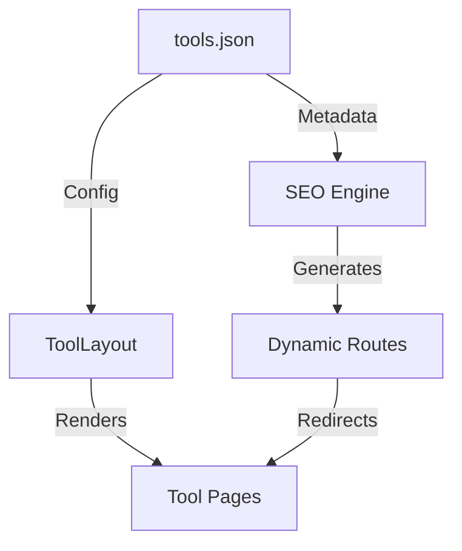

<div align="center">

# 🛠️ SopKit: The Ultimate Utility Engine

### **Free Online Tools • Privacy-First • No Signup Required**

[](https://github.com/SopKit/sopkit.github.io/stargazers)
[](https://github.com/SopKit/sopkit.github.io/blob/main/LICENSE)
[](https://github.com/SopKit/sopkit.github.io/issues)
[](https://dash.cloudflare.com/?to=/:account/pages/new)
[](https://nextjs.org/)
[](https://cloudflare.com)

**[sopkit.github.io](https://sopkit.github.io)** is a high-performance, developer-first tool ecosystem designed to dominate search results and provide professional utility at scale.

[Explore all tools →](https://sopkit.github.io/search)


---

</div>

## 💎 Cinematic Design. Massive Scale.

SopKit isn't just a repository of scripts; it's a **Utility Operating System**. Built with Next.js 16 and a premium Glassmorphism design system, it delivers a high-fidelity experience that converts traffic into users.

- **Free Online Tools**: A growing collection of utility tools for image processing, PDF workflows, social media, and more.
- **Privacy-First**: Most tool logic runs directly in your browser.
- **✨ Premium UI/UX**: Cinematic workspaces featuring backdrop-blur aesthetics, ambient glows, and high-fidelity micro-interactions.
- **🛡️ Privacy First**: 95% of tool logic runs directly in your browser. No files are uploaded to our servers unless absolutely necessary.
- **⚡ Performance Powered by Bun**: Optimized for ultra-fast build times and low-latency deployments on Cloudflare Workers/Pages.
- **🪄 YouTube Magic Redirect**: Replace `youtube.com` with `sopkit.github.io` in any video URL to open it instantly in our downloader (e.g., `youtube.com/watch?v=...` → `sopkit.github.io/watch?v=...`).

---

## 🏗️ Architecture

SopKit uses a **Data-Driven Architecture** where `tools.json` acts as the single source of truth for the entire platform.



---

## 🛠️ Tech Stack

- **Framework**: [Next.js 16](https://nextjs.org/) (App Router)
- **Runtime & Tooling**: [Bun](https://bun.sh/)
- **Design System**: [Tailwind CSS](https://tailwindcss.com/) + Custom Glassmorphism Logic
- **UI Components**: [Radix UI](https://www.radix-ui.com/), [Lucide Icons](https://lucide.dev/), [Framer Motion](https://www.framer.com/motion/)
- **SEO & Routing**: Advanced Proxy Engine with Modular Metadata
- **Cloud Infrastructure**: [Cloudflare Pages](https://pages.cloudflare.com/) + [OpenNext](https://open-next.js.org/)

---

## 🏁 Development

### 1. Clone & Install
```bash
git clone https://github.com/SopKit/sopkit.github.io.git
cd SopKit
bun install
```

### 2. Configure Environment
```bash
cp .env.example .env.local
```

**Stack Auth (required for login features):**
Create a free project at [app.stack-auth.com](https://app.stack-auth.com) and add your keys to `.env.local`:
```
NEXT_PUBLIC_STACK_PROJECT_ID=your-project-id
NEXT_PUBLIC_STACK_PUBLISHABLE_CLIENT_KEY=pck_...
STACK_SECRET_SERVER_KEY=ssk_...
```
The app works without Stack Auth keys — auth features will simply be disabled. No console errors will appear if keys are missing.

See [`.env.example`](.env.example) for all available environment variables.

### 3. Launch Workspace
```bash
bun dev
```

Open [http://localhost:3000](http://localhost:3000) to see your workspace.

### 4. Deploy to Cloudflare
```bash
bun run deploy
```

---

## 🤝 Open Source & Contributions

SopKit is built by the community, for the community. We believe in high-quality, free software that respects user privacy.

- **Found a bug?** Open an [Issue](https://github.com/SopKit/sopkit.github.io/issues).
- **Have a new tool idea?** Check out [.github/CONTRIBUTING.md](.github/CONTRIBUTING.md).
- **Want to help scale?** See [.github/OPEN_SOURCE.md](.github/OPEN_SOURCE.md) for our long-term vision.

## 📖 Documentation

For deeper dives into the architecture and design:
- [Architecture & Workflow](docs/AGENTS.md)
- [Design System & Guidelines](docs/DESIGN.md)
- [SEO Strategy](docs/seo-low-hanging-fruit-strategy.md)

---

<div align="center">

## ⭐ Support the Project

If you find this project valuable, please give it a star! It helps us grow the ecosystem and add more tools for everyone.

[](https://github.com/SopKit/sopkit.github.io/stargazers)

<br/>

Made with ❤️ and high-performance JS.

</div>