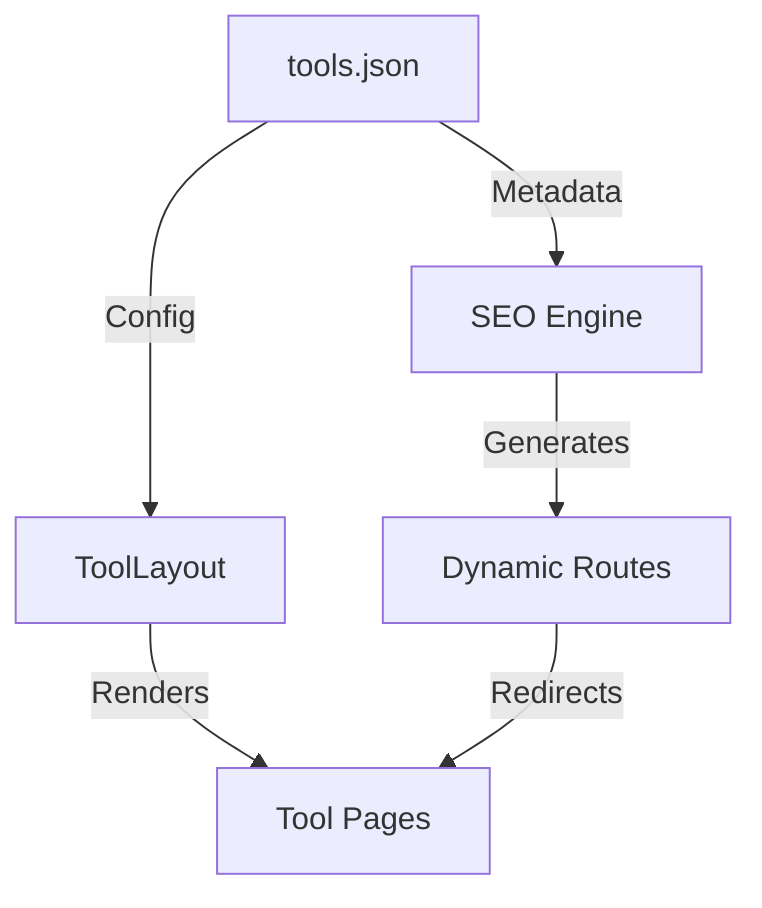

<div align="center">

# SopKit: Free Online Tools - Privacy-First Utility Engine

### **600+ Browser-Based Tools for Image, PDF, Video, SEO, Developer & More — No Signup Required**

[](https://github.com/SopKit/sopkit.github.io/stargazers)
[](https://github.com/SopKit/sopkit.github.io/blob/main/LICENSE)
[](https://github.com/SopKit/sopkit.github.io/issues)
[](https://dash.cloudflare.com/?to=/:account/pages/new)
[](https://nextjs.org/)
[](https://tailwindcss.com/)
[](https://sopkit.github.io)

**[sopkit.github.io](https://sopkit.github.io)** — A comprehensive free online toolkit designed for creators, developers, students, and professionals. Process images, edit PDFs, convert videos, analyze SEO, format code, generate passwords, and more — all directly in your browser with zero data uploads.

[Explore all 400+ tools →](https://sopkit.github.io/search)
[View sitemap →](https://sopkit.github.io/sitemap.xml)
[AI-friendly index →](https://sopkit.github.io/llms.txt)


---

</div>

## 📦 SopKit NPM Ecosystem

SopKit's core utility logic is available as individual, zero-dependency, strictly-typed packages under the `@sopkit` scope:

- **[`@sopkit/cli`](https://www.npmjs.com/package/@sopkit/cli)**: `npx @sopkit/cli` - Interactive prompt-driven CLI dashboard.
- **[`@sopkit/base64`](https://www.npmjs.com/package/@sopkit/base64)**: `npm i @sopkit/base64` - Unicode & URL-Safe Base64 encoder/decoder.
- **[`@sopkit/uuid`](https://www.npmjs.com/package/@sopkit/uuid)**: `npm i @sopkit/uuid` - Cryptographically secure UUID v4 & v1 generator.
- **[`@sopkit/slug`](https://www.npmjs.com/package/@sopkit/slug)**: `npm i @sopkit/slug` - Accent-normalized, multilingual URL slug generator.
- **[`@sopkit/json`](https://www.npmjs.com/package/@sopkit/json)**: `npm i @sopkit/json` - JSON formatter, minifier, and syntax validator.
- **[`@sopkit/color`](https://www.npmjs.com/package/@sopkit/color)**: `npm i @sopkit/color` - HEX, RGB, and HSL colorspace converter.
- **[`@sopkit/validator`](https://www.npmjs.com/package/@sopkit/validator)**: `npm i @sopkit/validator` - Email, URL, IP, credit card, and MAC address validation.
- **[`@sopkit/password`](https://www.npmjs.com/package/@sopkit/password)**: `npm i @sopkit/password` - Password generator and information entropy analyzer.

*Learn more and check out complete APIs at the live [SopKit Packages Directory](https://sopkit.github.io/packages).*

## What is SopKit?

SopKit is a **free online tools** platform with **600+ browser-based utilities** across **12+ categories**. Every tool is designed to work instantly without registration, software installation, or file uploads to external servers. We prioritize **privacy-first processing** — most tools run entirely in your browser.

### Why Choose SopKit?

- **Completely Free** — No hidden fees, premium tiers, or usage limits
- **Privacy-First** — 95% of tools process data locally; files never leave your device
- **No Signup Required** — Start using any tool instantly with zero friction
- **Iframe Embed Widgets** — Embed any tool directly onto your site via iframe, fully sandboxed
- **600+ Tools & Growing** — From image compression to SEO analysis, we cover every common workflow
- **Fast & Modern** — Built on Next.js 16 with optimized Core Web Vitals
- **Mobile-Friendly** — Fully responsive design works on all devices

## 🔧 Tools by Category

### 🖼️ Image Tools
[Free image tools online](https://sopkit.github.io/image-tools) for compression, resizing, conversion, background removal, and editing. Supports PNG, JPG, WebP, AVIF, GIF, and more.

**Popular:** [Image Compressor](https://sopkit.github.io/image-compressor) · [Image Converter](https://sopkit.github.io/image-converter) · [Image Resizer](https://sopkit.github.io/image-resizer) · [Background Remover](https://sopkit.github.io/background-remover) · [Image Cropper](https://sopkit.github.io/image-cropper) · [Favicon Generator](https://sopkit.github.io/favicon-generator)

### 📄 PDF Tools
[Free PDF tools online](https://sopkit.github.io/pdf-tools) for merging, splitting, compressing, converting, and editing PDF documents.

**Popular:** [PDF Merger](https://sopkit.github.io/pdf-merger) · [PDF Splitter](https://sopkit.github.io/pdf-splitter) · [PDF Compressor](https://sopkit.github.io/pdf-compressor) · [PDF to Word](https://sopkit.github.io/pdf-to-word) · [Word to PDF](https://sopkit.github.io/word-to-pdf)

### 🎬 Video Tools
[Free video tools online](https://sopkit.github.io/video-tools) for converting, compressing, and editing videos.

### 🎵 Audio Tools
[Free audio tools online](https://sopkit.github.io/audio-tools) including [text to speech](https://sopkit.github.io/text-to-speech) converter and guitar tuner.

### 📝 Text Tools
[Free text tools online](https://sopkit.github.io/text-tools) for word counting, case conversion, text comparison, ASCII converters, and more.

### 🔍 SEO Tools
[Free SEO tools online](https://sopkit.github.io/seo-tools) for meta tag generation, sitemap creation, keyword research, backlink checking, and SEO auditing.

**Popular:** [Meta Tag Generator](https://sopkit.github.io/meta-tag-generator) · [Sitemap Generator](https://sopkit.github.io/sitemap-generator) · [SEO Audit Tool](https://sopkit.github.io/seo-audit-tool) · [Keyword Research Tool](https://sopkit.github.io/keyword-research-tool) · [Backlink Checker](https://sopkit.github.io/backlink-checker)

### 💻 Developer Tools
[Free developer tools online](https://sopkit.github.io/developer-tools) for JSON formatting, Base64 encoding, regex testing, API key testing, code formatting, and cryptographic hashing.

**Popular:** [JSON Formatter](https://sopkit.github.io/json-formatter) · [Base64 Encode/Decode](https://sopkit.github.io/base64-encode) · [UUID Generator](https://sopkit.github.io/uuid-generator) · [Hash Generator](https://sopkit.github.io/hash-generator) · [API Key Testers](https://sopkit.github.io/api-key-testers)

### 📊 Calculators
[Free calculators online](https://sopkit.github.io/calculators) including BMI, loan, mortgage, percentage, and student-specific calculators.

### 🎲 Generators
[Free generators online](https://sopkit.github.io/generators) for passwords, QR codes, AI content, business names, and more.

### 📱 Exam Tools
[Free exam tools](https://sopkit.github.io/exam-tools) for photo resizing (SSC, UPSC, NEET, JEE, PAN card), signature resizing, and form image preparation.

### 📹 Video Downloaders
[Free downloaders](https://sopkit.github.io/all-downloaders) for YouTube, Instagram, TikTok, Facebook, Twitter, Reddit, and 40+ platforms.

## 🚀 Features

- **600+ free online tools** across 12 categories
- **Privacy-first architecture** — client-side processing for most tools
- **Structured data (JSON-LD)** — SoftwareApplication, FAQPage, HowTo, BreadcrumbList schemas on every tool page
- **Dynamic XML sitemap** with prioritized URLs
- **LLM-optimized index** at `/llms.txt` for AI search discoverability
- **OpenSearch support** for browser search integration
- **PWA-ready** with full manifest and service worker
- **Responsive design** optimized for mobile, tablet, and desktop
- **Iframe Embed Widgets** — Integrate any utility directly onto your site (e.g. `/embed-tool/?id=pdf-editor`) fully sandboxed.
- **Google Analytics, Clarity, and AdSense** integrated

## 🏗️ Architecture

SopKit uses a **data-driven architecture** with `tools.json` as the single source of truth:



### Tech Stack

- **Framework:** Next.js 16 (App Router)
- **Runtime:** Bun
- **Styling:** Tailwind CSS v4 + Glassmorphism Design System
- **UI Components:** Radix UI, Lucide Icons, Framer Motion
- **SEO:** Dynamic metadata API, JSON-LD structured data, XML sitemap, robots.txt
- **Analytics:** Google Analytics (G-HKX99R92SE), Microsoft Clarity, OneDollarStats
- **Monetization:** Google AdSense (ca-pub-1828915420581549)
- **Deployment:** Cloudflare Pages via OpenNext

## 🏁 Getting Started

### Prerequisites

- [Bun](https://bun.sh/) (recommended) or Node.js 20+
- Git

### Installation

```bash
# Clone the repository
git clone https://github.com/SopKit/sopkit.github.io.git
cd SopKit

# Install dependencies
bun install

# Set up environment variables
cp .env.example .env.local

# Start development server
bun dev
```

Open [http://localhost:3000](http://localhost:3000) to see the platform.

### Building for Production

```bash
bun run build
bun run export
```

### Deploying to Cloudflare Pages

```bash
bun run deploy
```

## 📋 Environment Variables

See [`.env.example`](.env.example) for all available environment variables. Stack Auth is optional — the app functions without it.

## 🤝 Contributing

We welcome contributions! Whether you're fixing bugs, adding new tools, or improving documentation:

- **Found a bug?** [Open an issue](https://github.com/SopKit/sopkit.github.io/issues)
- **Want a new tool?** Check our [contributing guide](.github/CONTRIBUTING.md)
- **See our vision** in [OPEN_SOURCE.md](.github/OPEN_SOURCE.md)

## 📖 Documentation

- [Newly Added Tools & Updates](https://sopkit.github.io/new-tools/)
- [Architecture & Workflow](docs/AGENTS.md)
- [Design System](docs/DESIGN_SYSTEM.md)
- [Low-Hanging-Fruit SEO Strategy](docs/seo-low-hanging-fruit-strategy.md)
- [SEO & Monetization Plan](docs/seo-monetization-plan.md)
- [Keyword Map](docs/keyword-map.md)

## 🔗 Related Projects

- [IndexFast](https://github.com/SH20RAJ/index-fast) — Lean SEO indexing SaaS
- [Linespedia](https://github.com/SH20RAJ/linepedia) — Programmatic SEO poetry engine
- [Sopplayer](https://github.com/SH20RAJ/Sopplayer) — Customizable HTML5 video player

## 📄 License

This project is open source. See the [LICENSE](LICENSE) file for details.

---

<div align="center">

## ⭐ Support the Project

If SopKit helps you, please star the repository — it helps others discover these free tools.

[](https://github.com/SopKit/sopkit.github.io/stargazers)
[](https://github.com/SopKit/sopkit.github.io/network/members)

Made with ❤️ and high-performance JS.

</div>
