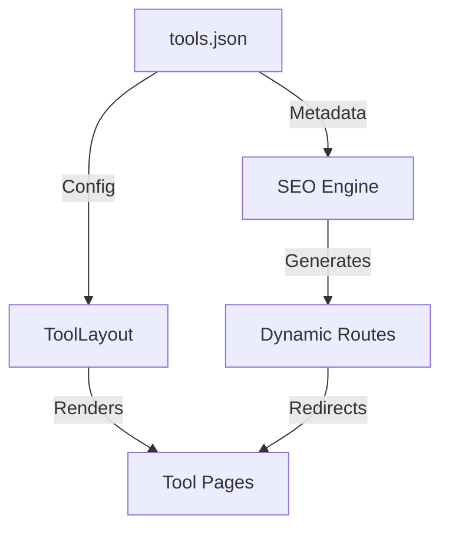

<div align="center">

# SopKit: Free Online Tools - Privacy-First Utility Engine

### **600+ Browser-Based Tools for Image, PDF, Video, SEO, Developer & More — No Signup Required**

[](https://github.com/SopKit/sopkit.github.io/stargazers)
[](https://github.com/SopKit/sopkit.github.io/blob/main/LICENSE)
[](https://github.com/SopKit/sopkit.github.io/issues)
[](https://dash.cloudflare.com/?to=/:account/pages/new)
[](https://nextjs.org/)
[](https://tailwindcss.com/)
[](https://sopkit.space)
<a href="https://visitorbadge.io/status?path=https%3A%2F%2Fsopkit.space%2F"></a>

**[sopkit.space](https://sopkit.space)** — A comprehensive free online toolkit designed for creators, developers, students, and professionals. Process images, edit PDFs, convert videos, analyze SEO, format code, generate passwords, and more — all directly in your browser with zero data uploads.

[Explore all 600+ tools →](https://sopkit.space/search)
[View sitemap →](https://sopkit.space/sitemap.xml)
[AI-friendly index →](https://sopkit.space/llms.txt)


---

</div>

## 📦 SopKit NPM Ecosystem

SopKit's core utility logic is available as individual, zero-dependency, strictly-typed packages under the `@sopkit` scope:

- **[`@sopkit/cli`](https://www.npmjs.com/package/@sopkit/cli)**: `npx @sopkit/cli` - Interactive prompt-driven CLI & direct command-line utilities.
- **[`@sopkit/base64`](https://www.npmjs.com/package/@sopkit/base64)**: `npm i @sopkit/base64` - Unicode & URL-Safe Base64 encoder/decoder.
- **[`@sopkit/uuid`](https://www.npmjs.com/package/@sopkit/uuid)**: `npm i @sopkit/uuid` - Cryptographically secure UUID v4 & v1 generator.
- **[`@sopkit/slug`](https://www.npmjs.com/package/@sopkit/slug)**: `npm i @sopkit/slug` - Accent-normalized, multilingual URL slug generator.
- **[`@sopkit/json`](https://www.npmjs.com/package/@sopkit/json)**: `npm i @sopkit/json` - JSON formatter, minifier, and syntax validator.
- **[`@sopkit/color`](https://www.npmjs.com/package/@sopkit/color)**: `npm i @sopkit/color` - HEX, RGB, and HSL colorspace converter.
- **[`@sopkit/validator`](https://www.npmjs.com/package/@sopkit/validator)**: `npm i @sopkit/validator` - Email, URL, IP, credit card, and MAC address validation.
- **[`@sopkit/password`](https://www.npmjs.com/package/@sopkit/password)**: `npm i @sopkit/password` - Password generator and information entropy analyzer.
- **[`@sopkit/xml`](https://www.npmjs.com/package/@sopkit/xml)**: `npm i @sopkit/xml` - XML formatter, minifier, and syntax validator.
- **[`@sopkit/jwt`](https://www.npmjs.com/package/@sopkit/jwt)**: `npm i @sopkit/jwt` - Zero-dependency JWT inspector and token parser.
- **[`@sopkit/hash`](https://www.npmjs.com/package/@sopkit/hash)**: `npm i @sopkit/hash` - High-performance SHA-256, SHA-512, MD5, and HMAC suite.

*Learn more and check out complete APIs at the live [SopKit Packages Directory](https://sopkit.space/packages).*

---

### ⚡ SopKit CLI Setup & Usage

The `@sopkit/cli` provides instant access to developer utilities directly in your terminal. It supports both a **visual interactive dashboard** and **direct one-liner commands** with pipe support.

<div align="center">
  
</div>

#### 1. Quickest Run (Zero Installation via `npx`)
```bash
# Interactive menu:
npx @sopkit/cli

# Direct command execution:
npx @sopkit/cli uuid v4 3
npx @sopkit/cli base64 encode "SopKit"
npx @sopkit/cli hash sha256 "secret"
npx @sopkit/cli slug "Love Calculator Story"
npx @sopkit/cli color "#ff3366"
npx @sopkit/cli password 24
```

#### 2. Global Installation (Enables `sopkit` command everywhere)
```bash
npm install -g @sopkit/cli

# Now run 'sopkit' directly from anywhere:
sopkit uuid v4 3
sopkit base64 encode "SopKit"
sopkit hash sha256 "secret"
sopkit slug "Love Calculator Story"
sopkit color "#ff3366"
sopkit password 24
```

#### 3. Local Development Link (Inside this repository)
If developing locally inside this cloned repository:
```bash
# Link the local CLI package to your global bin:
cd packages/cli && npm link && cd ../..

# Or run via root npm script:
npm run sopkit -- uuid v4 3
```

#### 4. Available CLI Commands

| Command | Description | Example |
| :--- | :--- | :--- |
| `sopkit` | Launch interactive menu | `sopkit` |
| `sopkit uuid [v4\|v1] [count]` | Generate random or timestamp UUIDs | `sopkit uuid v4 5` |
| `sopkit base64 <encode\|decode> <text>` | Fast Base64 conversion | `sopkit base64 encode "Hello"` |
| `sopkit hash <sha256\|sha512\|md5> <text>` | Cryptographic hash generator | `sopkit hash sha256 "my-token"` |
| `sopkit slug <text>` | Clean URL slug generator | `sopkit slug "Top 10 Online Tools"` |
| `sopkit color <hex>` | HEX to RGB/HSL converter | `sopkit color "#38bdf8"` |
| `sopkit password [length]` | Cryptographically secure password | `sopkit password 32` |
| `sopkit validator <email\|url\|ip> <val>` | RFC data format validator | `sopkit validator email "dev@sopkit.space"` |

---

## What is SopKit?

SopKit is a **free online tools** platform with **600+ browser-based utilities** across **12+ categories**. Every tool is designed to work instantly without registration, software installation, or file uploads to external servers. We prioritize **privacy-first processing** — most tools run entirely in your browser.

### Why Choose SopKit?

- **Completely Free** — No hidden fees, premium tiers, or usage limits
- **Privacy-First** — 95% of tools process data locally; files never leave your device
- **No Signup Required** — Start using any tool instantly with zero friction
- **Iframe Embed Widgets** — Embed any tool directly onto your site via iframe, fully sandboxed
- **600+ Tools & Growing** — From image compression to SEO analysis, we cover every common workflow
- **Fast & Modern** — Built on Next.js 16 with optimized Core Web Vitals
- **Mobile-Friendly** — Fully responsive design works on all devices

## 🧰 Tool Categories

SopKit covers common workflows for creators, developers, students, and professionals. Browse a category or jump directly to a popular tool.

| Category | What you'll find | Popular tools |
| :--- | :--- | :--- |
| 🖼️ **[Image Tools](https://sopkit.space/image-tools)** | Compress, resize, convert, crop, remove backgrounds, and edit images. | [Image Compressor](https://sopkit.space/image-compressor) · [Image Converter](https://sopkit.space/image-converter) · [Image Resizer](https://sopkit.space/image-resizer) |
| 📄 **[PDF Tools](https://sopkit.space/pdf-tools)** | Merge, split, compress, convert, and edit PDF documents. | [PDF Merger](https://sopkit.space/pdf-merger) · [PDF Splitter](https://sopkit.space/pdf-splitter) · [PDF Compressor](https://sopkit.space/pdf-compressor) |
| 🎬 **[Video Tools](https://sopkit.space/video-tools)** | Convert, compress, and work with video files. | Browse [Video Tools](https://sopkit.space/video-tools) |
| 🎵 **[Audio Tools](https://sopkit.space/audio-tools)** | Audio utilities, text-to-speech, and music-related tools. | [Text to Speech](https://sopkit.space/text-to-speech) · [Audio Tools](https://sopkit.space/audio-tools) |
| 📝 **[Text Tools](https://sopkit.space/text-tools)** | Count, transform, compare, format, and analyze text. | Browse [Text Tools](https://sopkit.space/text-tools) |
| 🔍 **[SEO Tools](https://sopkit.space/seo-tools)** | Metadata, sitemaps, keywords, backlinks, and SEO audits. | [Meta Tag Generator](https://sopkit.space/meta-tag-generator) · [Sitemap Generator](https://sopkit.space/sitemap-generator) · [SEO Audit](https://sopkit.space/seo-audit-tool) |
| 💻 **[Developer Tools](https://sopkit.space/developer-tools)** | JSON, Base64, UUIDs, regex, hashing, formatting, and API utilities. | [JSON Formatter](https://sopkit.space/json-formatter) · [Base64](https://sopkit.space/base64-encode) · [UUID Generator](https://sopkit.space/uuid-generator) |
| 📊 **[Calculators](https://sopkit.space/calculators)** | BMI, loans, mortgages, percentages, and student calculators. | Browse [Calculators](https://sopkit.space/calculators) |
| 🎲 **[Generators](https://sopkit.space/generators)** | Passwords, QR codes, business names, and other generators. | Browse [Generators](https://sopkit.space/generators) |
| 📱 **[Exam Tools](https://sopkit.space/exam-tools)** | Photo and signature preparation for SSC, UPSC, NEET, JEE, PAN, and forms. | Browse [Exam Tools](https://sopkit.space/exam-tools) |
| 📹 **[Video Downloaders](https://sopkit.space/all-downloaders)** | Download utilities for YouTube, Instagram, TikTok, Facebook, Reddit, and more. | Browse [All Downloaders](https://sopkit.space/all-downloaders) |

> **Explore everything:** [Search all 600+ tools →](https://sopkit.space/search)


## 🚀 Features

- **600+ free online tools** across 12 categories
- **Privacy-first architecture** — client-side processing for most tools
- **Structured data (JSON-LD)** — SoftwareApplication, FAQPage, HowTo, BreadcrumbList schemas on every tool page
- **Dynamic XML sitemap** with prioritized URLs
- **LLM-optimized index** at `/llms.txt` for AI search discoverability
- **OpenSearch support** for browser search integration
- **PWA-ready** with full manifest and service worker
- **Responsive design** optimized for mobile, tablet, and desktop
- **Iframe Embed Widgets** — Integrate any utility directly onto your site (e.g. `/embed-tool/?id=pdf-editor`) fully sandboxed.
- **Google Analytics, Clarity, and AdSense** integrated

## 🏗️ Architecture

SopKit uses a **data-driven architecture** with `tools.json` as the single source of truth:


```mermaid
graph TD
    A[tools.json] -->|Metadata| B[SEO Engine]
    A -->|Config| C[ToolLayout]
    B -->|Generates| D[Dynamic Routes]
    C -->|Renders| E[Tool Pages]
    D -->|Redirects| E
```

### Tech Stack

- **Framework:** Next.js 16 (App Router)
- **Runtime:** Bun
- **Styling:** Tailwind CSS v4 + Glassmorphism Design System
- **UI Components:** Radix UI, Lucide Icons, Framer Motion
- **SEO:** Dynamic metadata API, JSON-LD structured data, XML sitemap, robots.txt
- **Analytics:** Google Analytics (G-HKX99R92SE), Microsoft Clarity, OneDollarStats
- **Monetization:** Google AdSense (ca-pub-1828915420581549)
- **Deployment:** Cloudflare Pages via OpenNext

## 🏁 Getting Started

### Prerequisites

- [Bun](https://bun.sh/) (recommended) or Node.js 20+
- Git

### Installation

```bash
# Clone the repository
git clone https://github.com/SopKit/sopkit.github.io.git
cd SopKit

# Install dependencies
bun install

# Set up environment variables
cp .env.example .env.local

# Start development server
bun dev
```

Open [http://localhost:3000](http://localhost:3000) to see the platform.

### Building for Production

```bash
bun run build
bun run export
```

### Deploying to Cloudflare Pages

```bash
bun run deploy
```

## 📋 Environment Variables

See [`.env.example`](.env.example) for all available environment variables. Stack Auth is optional — the app functions without it.

## 🤝 Contributing

We welcome contributions! Whether you're fixing bugs, adding new tools, or improving documentation:

- **Found a bug?** [Open an issue](https://github.com/SopKit/sopkit.github.io/issues)
- **Want a new tool?** Check our [contributing guide](.github/CONTRIBUTING.md)
- **See our vision** in [OPEN_SOURCE.md](.github/OPEN_SOURCE.md)

## 📖 Documentation

- [Newly Added Tools & Updates](https://sopkit.space/new-tools/)
- [Architecture & Workflow](docs/AGENTS.md)
- [Design System](docs/DESIGN_SYSTEM.md)
- [Low-Hanging-Fruit SEO Strategy](docs/seo-low-hanging-fruit-strategy.md)
- [SEO & Monetization Plan](docs/seo-monetization-plan.md)
- [Keyword Map](docs/keyword-map.md)

## 🔗 Related Projects

- [IndexFast](https://github.com/SH20RAJ/index-fast) — Lean SEO indexing SaaS
- [Linespedia](https://github.com/SH20RAJ/linepedia) — Programmatic SEO poetry engine
- [Sopplayer](https://github.com/SH20RAJ/Sopplayer) — Customizable HTML5 video player

## 📄 License

This project is open source. See the [LICENSE](LICENSE) file for details.

---

<div align="center">

## ⭐ Support the Project

If SopKit helps you, please star the repository — it helps others discover these free tools.

[](https://github.com/SopKit/sopkit.github.io/stargazers)
[](https://github.com/SopKit/sopkit.github.io/network/members)

Made with ❤️ and high-performance JS.

</div>
