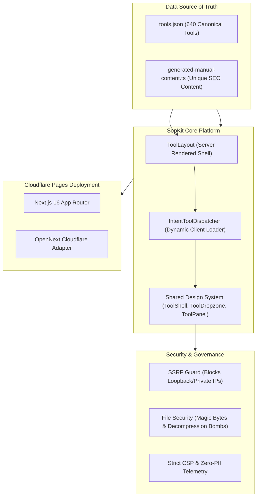

<div align="center">

# 🛠️ SopKit — Free Online Tools & Privacy-First Utility Engine

### **640+ Browser-Based Utilities for Developers, Creators, Students & Teams — 100% Client-Side & No Signup**

<p align="center">
  <a href="https://github.com/SopKit/sopkit.github.io/stargazers"></a>
  <a href="https://github.com/SopKit/sopkit.github.io/blob/main/LICENSE"></a>
  <a href="https://sopkit.space"></a>
  <a href="https://sopkit.space/sitemap.xml"></a>
  <a href="https://nextjs.org/"></a>
  <a href="https://bun.sh/"></a>
  <a href="https://tailwindcss.com/"></a>
  <a href="https://dash.cloudflare.com/?to=/:account/pages/new"></a>
</p>

<p align="center">
  <a href="https://sopkit.space"><strong>Explore Platform</strong></a> •
  <a href="https://sopkit.space/online-tools"><strong>All 640+ Tools</strong></a> •
  <a href="#-sopkit-cli"><strong>Terminal CLI</strong></a> •
  <a href="#-sopkit-npm-ecosystem"><strong>NPM Packages</strong></a> •
  <a href="#-embed-any-tool-on-your-site"><strong>Embed Widgets</strong></a> •
  <a href="#️-architecture"><strong>Architecture</strong></a> •
  <a href="https://sopkit.space/llms.txt"><strong>LLMs.txt</strong></a>
</p>

<a href="https://visitorbadge.io/status?path=https%3A%2F%2Fsopkit.space%2F"></a>

<br />

<a href="https://sopkit.space">
  
</a>

<br />

**[sopkit.space](https://sopkit.space)** is a high-performance, open-source platform hosting **640+ free browser-based tools**. From image compression, PDF manipulation, and video conversions to developer utilities, SEO analyzers, and student calculators — everything runs directly on your device via modern web standards (WebAssembly, Web Crypto, Canvas API, PDF-lib) with **zero file uploads** to external servers.

</div>

---

## 🌟 Why SopKit?

| Feature | Description |
| :--- | :--- |
| 🔒 **100% Privacy-First** | Files, passwords, and sensitive documents are processed locally inside your browser sandbox. No file ever uploads to remote servers. |
| ⚡ **Zero-Latency Execution** | Powered by WebAssembly and local JavaScript engines for instantaneous results without upload/download lag. |
| 🚫 **No Signup & No Friction** | Unlimited access forever without credit cards, captchas, paywalls, or accounts. |
| 🧩 **Embeddable Everywhere** | Any tool can be embedded into third-party blogs or platforms as a responsive, sandboxed iframe widget. |
| 💻 **Interactive CLI Utility** | Access your favorite developer utilities right from your terminal with `@sopkit/cli`. |
| 📦 **Modular NPM Libraries** | Zero-dependency, tree-shakeable TypeScript utility libraries published across the `@sopkit` scope. |
| 🤖 **AEO & LLM Discoverable** | Fully structured with Schema.org JSON-LD, automated sitemaps, and optimized `/llms.txt` indices. |

---

## 💻 SopKit CLI

The **`@sopkit/cli`** provides instant access to developer utilities directly in your terminal. It features both a **visual interactive dashboard** and **direct one-liner commands** with full UNIX pipe support.

<div align="center">
  
</div>

### 1. Instant Run (Zero Installation via `npx`)
```bash
# Launch interactive terminal UI:
npx @sopkit/cli

# Direct one-liner commands:
npx @sopkit/cli uuid v4 3
npx @sopkit/cli base64 encode "SopKit"
npx @sopkit/cli hash sha256 "secret-token"
npx @sopkit/cli slug "Top 10 Online Tools for Developers"
npx @sopkit/cli color "#38bdf8"
npx @sopkit/cli password 32
```

### 2. Global Installation
```bash
# Install globally to your system:
npm install -g @sopkit/cli

# Now execute 'sopkit' anywhere:
sopkit uuid v4 5
sopkit base64 encode "Hello World"
sopkit hash sha512 "payload"
sopkit validator email "dev@sopkit.space"
```

### 3. CLI Command Reference

| Command | Action | Example |
| :--- | :--- | :--- |
| `sopkit` | Interactive menu selector | `sopkit` |
| `sopkit uuid [v4\|v1] [count]` | Generate random or timestamp UUIDs | `sopkit uuid v4 5` |
| `sopkit base64 <encode\|decode> <str>` | Standard & URL-safe Base64 codec | `sopkit base64 encode "SopKit"` |
| `sopkit hash <sha256\|sha512\|md5> <str>` | Cryptographic hash generation | `sopkit hash sha256 "payload"` |
| `sopkit slug <text>` | Accent-normalized, SEO URL slug maker | `sopkit slug "Free Online Tools"` |
| `sopkit color <hex>` | HEX to RGB / HSL conversion | `sopkit color "#38bdf8"` |
| `sopkit password [length]` | Entropy-based cryptographic password generator | `sopkit password 24` |
| `sopkit validator <email\|url\|ip> <val>` | RFC data format verification | `sopkit validator email "test@sopkit.space"` |

---

## 📦 SopKit NPM Ecosystem

SopKit's core algorithms are open-sourced as standalone, zero-dependency, strictly-typed npm packages under the `@sopkit` scope:

| Package | Install Command | Functionality |
| :--- | :--- | :--- |
| **[`@sopkit/cli`](https://www.npmjs.com/package/@sopkit/cli)** | `npm i -g @sopkit/cli` | Interactive prompt-driven CLI & terminal utility suite. |
| **[`@sopkit/base64`](https://www.npmjs.com/package/@sopkit/base64)** | `npm i @sopkit/base64` | Unicode & URL-safe Base64 encoder/decoder with zero dependencies. |
| **[`@sopkit/uuid`](https://www.npmjs.com/package/@sopkit/uuid)** | `npm i @sopkit/uuid` | Cryptographically secure UUID v4 & v1 generator. |
| **[`@sopkit/slug`](https://www.npmjs.com/package/@sopkit/slug)** | `npm i @sopkit/slug` | Multilingual, accent-normalized URL slug generator. |
| **[`@sopkit/json`](https://www.npmjs.com/package/@sopkit/json)** | `npm i @sopkit/json` | Blazing-fast JSON validator, formatter, and minifier. |
| **[`@sopkit/color`](https://www.npmjs.com/package/@sopkit/color)** | `npm i @sopkit/color` | Complete HEX, RGB, and HSL colorspace converter. |
| **[`@sopkit/validator`](https://www.npmjs.com/package/@sopkit/validator)** | `npm i @sopkit/validator` | Lightweight email, URL, IP, credit card, and MAC address validation. |
| **[`@sopkit/password`](https://www.npmjs.com/package/@sopkit/password)** | `npm i @sopkit/password` | Secure password generator and Shannon entropy analyzer. |
| **[`@sopkit/xml`](https://www.npmjs.com/package/@sopkit/xml)** | `npm i @sopkit/xml` | XML syntax validator, tree formatter, and minifier. |
| **[`@sopkit/jwt`](https://www.npmjs.com/package/@sopkit/jwt)** | `npm i @sopkit/jwt` | Lightweight, zero-dependency JWT inspector and token decoder. |
| **[`@sopkit/hash`](https://www.npmjs.com/package/@sopkit/hash)** | `npm i @sopkit/hash` | High-performance SHA-256, SHA-512, MD5, and HMAC suite. |
| **[`@sopkit/player`](https://www.npmjs.com/package/@sopkit/player)** | `npm i @sopkit/player` | Core playback, time-formatting, and clamping utilities. |

*Explore full documentation and live playgrounds at [sopkit.space/packages](https://sopkit.space/packages).*

---

## 🧰 Tools Directory

Browse SopKit's catalog of 640+ utilities across 20 specialized categories:

| Category | Tools | Capabilities & Popular Tools |
| :--- | :---: | :--- |
| 💻 **[Developer Tools](https://sopkit.space/developer-tools)** | 114 | [JSON Formatter](https://sopkit.space/json-formatter) · [Base64 Encode](https://sopkit.space/base64-encode) · [UUID Generator](https://sopkit.space/uuid-generator) · Regex Testers · JWT Inspectors |
| 🛠️ **[Utilities](https://sopkit.space/online-tools)** | 93 | Unit converters, time zone tools, encoding helpers, batch processors, and web utilities. |
| 🎬 **[Video Tools](https://sopkit.space/video-tools)** | 82 | Client-side video compressors, frame extractors, format converters, and players. |
| 🖼️ **[Image Tools](https://sopkit.space/image-tools)** | 54 | [Image Compressor](https://sopkit.space/image-compressor) · [Image Converter](https://sopkit.space/image-converter) · [Image Resizer](https://sopkit.space/image-resizer) · WebP/PNG conversions |
| 📊 **[Calculators](https://sopkit.space/calculators)** | 48 | Financial loan/EMI calculators, percentage calculators, scientific computation, and student math. |
| 📝 **[Text Tools](https://sopkit.space/text-tools)** | 38 | Word & character counters, diff checkers, case converters, line sorters, and typography formatters. |
| 🎲 **[Fun Generators](https://sopkit.space/generators)** | 36 | QR code generators, secure password generators, mock data makers, and lorem ipsum builders. |
| 📹 **[YouTube Tools](https://sopkit.space/youtube-tag-extractor)** | 31 | Tag extractors, thumbnail downloaders, hashtag analyzers, description formatters, and channel utilities. |
| 🛡️ **[Privacy Tools](https://sopkit.space/privacy-tools)** | 23 | Metadata strippers, local file encryptors, hash generators, password audits, and safe storage check. |
| 📄 **[PDF Tools](https://sopkit.space/pdf-tools)** | 22 | [PDF Merger](https://sopkit.space/pdf-merger) · [PDF Splitter](https://sopkit.space/pdf-splitter) · [PDF Compressor](https://sopkit.space/pdf-compressor) · PDF Rotate/Protect |
| 🔍 **[SEO Tools](https://sopkit.space/seo-tools)** | 21 | [Meta Tag Generator](https://sopkit.space/meta-tag-generator) · [Sitemap Generator](https://sopkit.space/sitemap-generator) · OpenGraph builders · Robots.txt analyzers |
| 🎓 **[Exam Tools](https://sopkit.space/exam-tools)** | 20 | Government & academic form image dimension resizers (UPSC, SSC, NEET, JEE, GATE, PAN). |
| 📥 **[Extraction Tools](https://sopkit.space/url-extractor)** | 11 | [URL Extractor](https://sopkit.space/url-extractor) · Email Extractor · Regex Extractor · JSON Path Extractor · HTML Link Extractor |
| 🤖 **[AI Tools](https://sopkit.space/ai-prompt-generator)** | 12 | Prompt generators, AI model cost estimators, system prompt templates, and token calculators. |
| 🎵 **[Audio Tools](https://sopkit.space/audio-tools)** | 12 | Audio trim, tone generators, format converters, bit-depth converters, and frequency analyzers. |
| 🩺 **[Health Tools](https://sopkit.space/bmi-calculator)** | 5 | Body mass index (BMI), basal metabolic rate (BMR), calorie estimators, and body composition. |
| 📹 **[Video Downloaders](https://sopkit.space/all-downloaders)** | Multi | Media retrieval helpers for open platforms and educational video archives. |

> 🔍 **Need a specific tool?** Use the live instant search at [sopkit.space/search](https://sopkit.space/search) or explore [sopkit.space/online-tools](https://sopkit.space/online-tools).

---

## 🧩 Embed Any Tool on Your Site

Every SopKit tool is ready to embed into any website, blog, or CMS using a lightweight, sandboxed iframe.

```html
<!-- Example: Embed the SopKit PDF Editor / Compressor -->
<iframe
  src="https://sopkit.space/embed-tool/?id=pdf-editor&theme=dark"
  width="100%"
  height="680"
  frameborder="0"
  loading="lazy"
  sandbox="allow-scripts allow-same-origin allow-downloads allow-forms"
  style="border-radius: 12px; border: 1px solid rgba(255,255,255,0.1); max-width: 100%;"
  title="SopKit Sandboxed Tool Embed"
></iframe>
```

Customize theme (`theme=dark` or `theme=light`) and accent color directly via query parameters. Discover embed snippets for all tools on [sopkit.space/tool-id](https://sopkit.space/tool-id).

---

## 🏗️ Architecture & Invariants

SopKit is engineered with a strict **data-driven architecture** ensuring extreme speed, zero layout shift (zero CLS), and sandboxed execution:


```mermaid
flowchart TD
    subgraph Registry["Data Source of Truth"]
        toolsJSON["tools.json (640 Canonical Tools)"]
        manualContent["generated-manual-content.ts (Unique SEO Content)"]
    end

    subgraph CoreEngine["SopKit Core Platform"]
        ToolLayout["ToolLayout (Server Rendered Shell)"]
        Dispatcher["IntentToolDispatcher (Dynamic Client Loader)"]
        DesignSystem["Shared Design System (ToolShell, ToolDropzone, ToolPanel)"]
    end

    subgraph Security["Security & Governance"]
        SSRF["SSRF Guard (Blocks Loopback/Private IPs)"]
        FileValidation["File Security (Magic Bytes & Decompression Bombs)"]
        CSP["Strict CSP & Zero-PII Telemetry"]
    end

    subgraph Edge["Cloudflare Pages Deployment"]
        NextEdge["Next.js 16 App Router"]
        OpenNext["OpenNext Cloudflare Adapter"]
    end

    Registry --> ToolLayout
    Registry --> CoreEngine
    ToolLayout --> Dispatcher
    Dispatcher --> DesignSystem
    DesignSystem --> Security
    CoreEngine --> Edge
```

### Key Architectural Standards
1. **Design System Invariant**: All interactive tool interfaces are built using centralized components (`ToolShell`, `ToolPanel`, `ToolDropzone`, `ToolModeTabs`, `ToolField`) from `@/components/tools/shared/design-system` — never hand-rolled wrappers.
2. **Central Dispatcher**: All dynamic tools load on-demand via `IntentToolDispatcher.tsx` to maintain minimal initial bundle weights (< 80 KiB).
3. **Strict Security Hardening**: SSRF defense blocks loopback, link-local, and RFC 1918 subnets (`src/server/security/ssrf.ts`). File uploads are guarded against decompression bombs and MIME tampering (`src/server/security/file-validation.ts`).
4. **Zero-CLS Monetization**: Any future advertisement container utilizes pre-reserved CSS containment with zero layout shift displacement (`SHOW_SCRIPTLY_ADS = false` globally enforced).

---

## 🏁 Getting Started

### Prerequisites
- [Bun](https://bun.sh/) v1.2+ (strongly recommended) or Node.js v20+
- Git

### Installation & Local Setup

```bash
# 1. Clone the repository
git clone https://github.com/SopKit/sopkit.github.io.git
cd sopkit.github.io

# 2. Install dependencies
bun install

# 3. Configure environment variables
cp .env.example .env.local

# 4. Start the Turbopack development server
bun dev
```

Visit [http://localhost:3000](http://localhost:3000) to view the application.

---

## 🧪 Verification & Health Checks

Run the verification pipeline before committing changes:

```bash
# 1. Validate tool registry integrity (0 duplicates, 640 tools)
bun scripts/validate-registry.ts

# 2. Run automated technical SEO & canonical validation
bun scripts/validate-seo-architecture.ts

# 3. Execute architecture, security, and SEO unit tests
bun test ./tests/unit/registry.test.ts ./tests/unit/budget.test.ts ./tests/unit/search.test.ts ./tests/unit/analytics.test.ts ./tests/seo/metadata.test.ts ./tests/seo/schema.test.ts ./tests/security/file-validation.test.ts ./tests/security/headers.test.ts ./tests/security/ssrf.test.ts

# 4. Audit sitemap URLs health (100% 200 OK)
bun scripts/audit-sitemap-urls.ts

# 5. Typecheck TypeScript codebase
bun run typecheck
```

> **Note**: Do not run production build commands (`bun run build`) in local development terminals. Production builds are handled automatically in CI/CD via OpenNext for Cloudflare Pages.

---

## 🤝 Contributing

Contributions are warmly welcomed! Please read our [Contributing Guide](CONTRIBUTING.md) and check [ARCHITECTURE.md](ARCHITECTURE.md) before submitting pull requests.

1. Fork the Project
2. Create your Feature Branch (`git checkout -b feat/NewAwesomeTool`)
3. Commit your Changes (`git commit -m 'feat(tool): add NewAwesomeTool'`)
4. Verify tests (`bun test:arch`)
5. Push to the Branch (`git push origin feat/NewAwesomeTool`)
6. Open a Pull Request

---

## 📄 License

Distributed under the **MIT License**. See [`LICENSE`](LICENSE) for complete details.

---

<div align="center">

### ⭐ Support SopKit

If SopKit saved you time or helped your project, give us a star on GitHub — it helps others discover these free, privacy-first tools!

[](https://github.com/SopKit/sopkit.github.io/stargazers)

<br />

Crafted with ❤️ and high-performance TypeScript.

</div>
