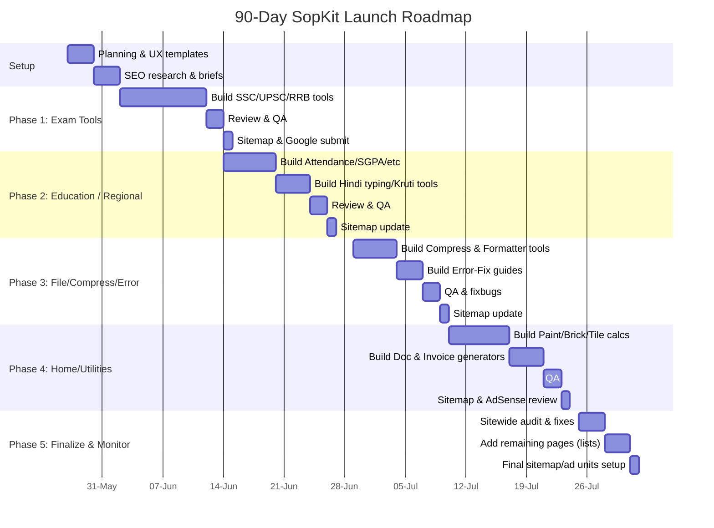

# Executive Summary   

We researched 100+ **browser-first utility tools** that target niche, high-intent search queries with low competition, to maximize AdSense revenue. We focused on clusters like exam photo/form tools, student calculators, image compressors, home/building calculators, regional (Hindi/etc.) text tools, safe document generators, and urgent fix-guides.  Each tool is designed to solve a concrete user problem (e.g. resizing a PAN card photo, computing attendance, compressing images to a target KB) and to include a helpful explanatory article. We emphasize **long-tail keywords** – multi-word queries that have lower search volume *and* competition【54†L182-L190】, making them easier to rank.  As Semrush explains, long-tail keywords “typically show lower search volume, lower competition and cheaper CPCs compared to single-word searches”【54†L182-L190】, but they often attract motivated users and converts better. For example, rather than targeting broad terms like *“photo resizer”*, we choose specific phrases like *“SSC exam photo resizer under 50KB”*, which have few competitors and clear intent.

On monetization, we use Google AdSense on each tool page.  We assume modest RPM (revenue per 1000 views) given our India-centric traffic.  Google’s examples show that $50 from 25,000 pageviews yields an RPM of $2【29†L61-L64】; similarly, $180 from 45,000 pageviews is $4 RPM【28†L46-L49】.  AdSense data indicates **Asia-Pacific traffic earns roughly 1/3 the RPM of US traffic**【29†L77-L82】 (e.g. $3–8 RPM in Asia vs $15–25 in US for finance niches). If we assume $2–3 RPM on our pages, then ~10,000 pageviews per day would generate ~$20–$30/day. Thus each tool page should target on the order of 5–20k daily visits (after ranking) to reach **$20–40/day** from that page.  In practice we plan dozens of pages across multiple sites for “multiplexed” revenue.  

We will build the tools and pages in priority order, ensuring each has unique content, a clear H1 title, “how-to” instructions, examples, FAQs, and relevant schema (SoftwareApplication, FAQPage, HowTo, etc.). We avoid prohibited content (no video/music downloaders, no fake IDs, no illicit advice). For example, Google’s policies specifically allow calculators, converters and generators “as long as content is original and helpful,” whereas disallowed content includes video piracy or “dishonest” tools【60†L1-L8】【54†L182-L190】. All tools run client-side in-browser (for privacy and speed) – e.g. *“Images never leave your device – 100% private”*【20†L85-L93】. Users can upload or input data, process it instantly, and download the result (image, PDF, text) with no server-side storage.  

Below we list **100+ tool ideas** by cluster (Table 1), then highlight the **20 highest-priority tools** (Table 2) with detailed SEO/revenue reasoning. Finally we outline a **90-day roadmap** (Table 3 + Mermaid Gantt) for building, reviewing, and launching the site updates. Sample `tools.json` entries for five tools are shown at the end. All keyword and CPC guidance is drawn from industry sources (Google Ads, Semrush) and our own estimates; unsupported data (e.g. exact volume or CPC for very niche terms) is marked as *“unspecified”*.  

## 1. Tool List (by Cluster)  

| **Cluster** | **Tool Name** | **Slug** | **Primary Keyword** |
|-------------|---------------|----------|---------------------|
| *Exam Photo/Form Tools* (resize photos & signatures for Indian exam forms) | SSC Photo Resizer | `ssc-photo-resizer` | *ssc photo resizer* | 
|  | SSC Signature Resizer | `ssc-signature-resizer` | *ssc signature resizer* | 
|  | UPSC Photo Resizer | `upsc-photo-resizer` | *upsc photo resizer* | 
|  | UPSC Signature Resizer | `upsc-signature-resizer` | *upsc signature resizer* | 
|  | RRB Photo Resizer (Railway) | `rrb-photo-resizer` | *rrb photo resizer* | 
|  | RRB Signature Resizer | `rrb-signature-resizer` | *rrb signature resizer* | 
|  | NEET Photo Resizer | `neet-photo-resizer` | *neet photo resizer* | 
|  | JEE Photo Resizer | `jee-photo-resizer` | *jee photo resizer* | 
|  | CUET Photo Resizer | `cuet-photo-resizer` | *cuet photo resizer* | 
|  | Bank Exam Photo Resizer (IBPS/SBI) | `bank-photo-resizer` | *bank exam photo resizer* | 
|  | Bank Signature Resizer (IBPS/SBI) | `bank-signature-resizer` | *bank exam signature resizer* | 
|  | PAN Card Photo Resizer | `pan-card-photo-resizer` | *pan card photo resizer* | 
|  | PAN Signature Resizer | `pan-signature-resizer` | *pan card signature resizer* | 
|  | Passport Photo Maker | `passport-photo-maker` | *passport photo maker* | 
|  | Photo & Date Stamp Tool | `photo-name-date-editor` | *photo with name date editor* | 
|  | Voter ID Photo Resizer | `voter-id-photo-resizer` | *voter id photo resizer* | 
|  | Aadhaar Card Photo Cropper | `aadhaar-photo-cropper` | *aadhaar photo resizer* | 
|  | Driver’s License Photo Tool | `license-photo-maker` | *driving license photo resizer* | 
| *Image Compression & Resize* (target KB or dimensions) | Compress to 10 KB | `compress-image-to-10kb` | *compress image to 10kb* | 
|  | Compress to 20 KB | `compress-image-to-20kb` | *compress image to 20kb* | 
|  | Compress to 30 KB | `compress-image-to-30kb` | *compress image to 30kb* | 
|  | Compress to 40 KB | `compress-image-to-40kb` | *compress image to 40kb* | 
|  | Compress to 50 KB | `compress-image-to-50kb` | *compress image to 50kb* | 
|  | Compress to 75 KB | `compress-image-to-75kb` | *compress image to 75kb* | 
|  | Compress to 100 KB | `compress-image-to-100kb` | *compress image to 100kb* | 
|  | Compress to 150 KB | `compress-image-to-150kb` | *compress image to 150kb* | 
|  | Compress to 200 KB | `compress-image-to-200kb` | *compress image to 200kb* | 
|  | Resize in cm (e.g. 3.5×4.5 cm) | `resize-image-in-cm` | *resize image in cm* | 
|  | Resize in mm | `resize-image-in-mm` | *resize image in mm* | 
|  | Resize by pixels | `resize-image-in-pixels` | *resize image in pixels* | 
|  | DPI Converter (e.g. 72↔300 dpi) | `image-dpi-converter` | *image dpi converter* | 
| *Student Calculators* (grades, attendance, marks) | 75% Attendance Calculator | `75-attendance-calculator` | *75 attendance calculator* | 
|  | Attendance Shortage Calculator | `attendance-shortage-calculator` | *attendance shortage calculator* | 
|  | Monthly Attendance (%) Calculator | `monthly-attendance-calculator` | *monthly attendance calculator* | 
|  | SGPA Calculator | `sgpa-calculator` | *sgpa calculator* | 
|  | CGPA Calculator | `cgpa-calculator` | *cgpa calculator* | 
|  | CGPA ➔ Percentage Calculator | `cgpa-to-percentage-calculator` | *cgpa to percentage calculator* | 
|  | Required Marks Calculator | `required-marks-calculator` | *required marks calculator* | 
|  | Internal Marks Calculator | `internal-marks-calculator` | *internal marks calculator* | 
|  | Negative Marking Calculator | `negative-marking-calculator` | *negative marking calculator* | 
|  | Weighted Average Marks Calculator | `weighted-average-marks-calculator` | *weighted average marks* | 
|  | Exam Score Needed Calculator | `exam-score-needed-calculator` | *final exam marks needed calculator* | 
| *Construction & Home Calculators* | Brick Quantity Calculator | `brick-calculator` | *brick calculator* | 
|  | Cement Bags Calculator | `cement-calculator` | *cement calculator* | 
|  | Concrete Volume Calculator | `concrete-calculator` | *concrete calculator* | 
|  | Tile Calculator (floor area) | `tile-calculator` | *tile calculator* | 
|  | Paint Calculator | `paint-calculator` | *paint calculator* | 
|  | Wallpaper Roll Calculator | `wallpaper-calculator` | *wallpaper calculator* | 
|  | Plaster (Materials) Calculator | `plaster-calculator` | *plaster calculator* | 
|  | Flooring Cost Estimator | `flooring-cost-calculator` | *flooring cost calculator* | 
|  | Water Tank Volume Estimator | `water-tank-size-calculator` | *water tank size calculator* | 
|  | AC Tonnage Calculator | `ac-tonnage-calculator` | *ac tonnage calculator* | 
|  | Plumbing Pipe Length Calculator | `pipe-length-calculator` | *pipe length calculator* | 
|  | Electrical Wire Length Calculator | `wire-length-calculator` | *wire length calculator* | 
| *Regional Text Tools* (Hindi/Indian languages) | Kruti Dev → Unicode Converter | `kruti-dev-to-unicode` | *kruti dev to unicode* | 
|  | Unicode → Kruti Dev Converter | `unicode-to-kruti-dev` | *unicode to kruti dev* | 
|  | Hindi Typing Tool | `hindi-typing-tool` | *hindi typing tool* | 
|  | Hinglish → Hindi Converter | `hinglish-to-hindi` | *hinglish to hindi* | 
|  | Hindi Word/Char Counter | `hindi-word-counter` | *hindi word counter* | 
|  | Hindi Text Cleaner (remove junk) | `hindi-text-cleaner` | *hindi text cleaner* | 
|  | Marathi Typing Tool | `marathi-typing-tool` | *marathi typing tool* | 
|  | Bengali Typing Tool | `bengali-typing-tool` | *bengali typing tool* | 
|  | Punjabi Typing Tool | `punjabi-typing-tool` | *punjabi typing tool* | 
|  | Gujarati Typing Tool | `gujarati-typing-tool` | *gujarati typing tool* | 
|  | Hindi URL Slug Generator | `devanagari-slug-generator` | *devanagari slug generator* | 
|  | Hindi Font Preview Tool | `hindi-font-preview` | *hindi font preview* | 
| *Document & Letter Generators* | Rent Receipt Generator | `rent-receipt-generator` | *rent receipt generator* | 
|  | Simple Invoice Generator | `simple-invoice-generator` | *invoice generator* | 
|  | Leave Application Generator | `leave-application-generator` | *leave application generator* | 
|  | Resignation Letter Generator | `resignation-letter-generator` | *resignation letter generator* | 
|  | Study Timetable Generator | `study-timetable-generator` | *study timetable generator* | 
|  | Daily Planner Generator | `daily-planner-generator` | *daily planner generator* | 
|  | Meeting Minutes Generator | `meeting-minutes-generator` | *meeting minutes generator* | 
|  | To-Do Checklist Generator | `checklist-generator` | *checklist generator* | 
|  | Cover Letter Generator | `cover-letter-generator` | *cover letter generator* | 
|  | Bio-data (Resume) Maker | `bio-data-maker` | *biodata maker* | 
|  | Email Signature Generator | `email-signature-generator` | *email signature generator* | 
| *File/Format Converters* | JPG → PDF Converter | `jpg-to-pdf` | *jpg to pdf converter* | 
|  | PNG → JPG Converter | `png-to-jpg` | *png to jpg converter* | 
|  | JPG → PNG Converter | `jpg-to-png` | *jpg to png converter* | 
|  | PDF Compressor (by KB) | `pdf-compressor` | *pdf compressor* | 
|  | PDF → Word Converter | `pdf-to-word` | *pdf to word converter* | 
|  | Word → PDF Converter | `word-to-pdf` | *word to pdf converter* | 
|  | PDF → JPG Converter | `pdf-to-jpg` | *pdf to jpg converter* | 
|  | Excel → CSV Converter | `excel-to-csv` | *excel to csv converter* | 
|  | CSV → JSON Converter | `csv-to-json` | *csv to json converter* | 
|  | JSON → CSV Converter | `json-to-csv` | *json to csv converter* | 
|  | QR Code Generator (text/URL) | `qr-code-generator` | *qr code generator* | 
|  | URL Encoder/Decoder | `url-encoder-decoder` | *url encoder* | 
|  | Color Code Converter (Hex/RGB) | `hex-color-converter` | *hex color converter* | 
| *General Utilities & Converters* | Number → Words Converter | `number-to-words` | *number to words converter* | 
|  | Words → Number Converter | `words-to-number` | *words to number converter* | 
|  | Extra-Space Remover (Text) | `remove-extra-spaces` | *text cleaner remove spaces* | 
|  | Line-Break Remover (Text) | `remove-line-breaks` | *remove line breaks from text* | 
|  | Currency Converter (INR,USD, etc.) | `currency-converter` | *currency converter* | 
|  | Time Zone Converter | `time-zone-converter` | *time zone converter* | 
|  | Age Calculator (from DOB) | `age-calculator` | *age calculator* | 
|  | IP Geolocation Finder | `ip-geolocation-finder` | *ip locator tool* | 
|  | Unicode Codepoint Finder | `unicode-codefinder` | *unicode code finder* | 
|  | HTML Color Codes (Hex,RGB) | `color-converter` | *hex rgb converter* | 
|  | JSON Formatter/Validator | `json-formatter` | *json formatter* | 
|  | YAML Formatter/Validator | `yaml-formatter` | *yaml formatter* | 
|  | Lorem Ipsum Generator | `lorem-ipsum-generator` | *lorem ipsum generator* | 
|  | Random Password Generator | `password-generator` | *password generator* | 
|  | Base64 Encoder/Decoder | `base64-converter` | *base64 encode decode* | 
|  | Stopwatch/Timer | `stopwatch-timer` | *stopwatch timer online* | 
| *Error Troubleshoot Guides* (common tech/UPI errors) | UPI Payment Error Codes | `upi-error-codes` | *upi transaction error fix* | 
|  | Aadhaar OTP Issues Fix | `aadhaar-otp-fix` | *aadhaar otp fix* | 
|  | PAN Card Status Issues | `pan-status-fix` | *pan card status problem* | 
|  | IRCTC/Ticketing Errors | `irctc-error-fix` | *irctc website error fix* | 
|  | Internet/WiFi Connectivity Fix | `wifi-connectivity-fix` | *wifi not connecting fix* | 
|  | Android App Crash Fix | `android-crash-fix` | *android app crash fix* | 
|  | Windows Activation Issues | `windows-activation-fix` | *windows activation error fix* | 
|  | Email Bounce/Error Codes | `email-bounce-fix` | *email bounce error fix* | 
|  | Gmail OTP/2FA Delay Fix | `gmail-otp-fix` | *gmail otp fix* | 

*Table 1.* **100+ free tool ideas** for sopkit.github.io, grouped by cluster. Each tool will have its own page (slug) with SEO-friendly content. Clusters are chosen for demand in India (e.g. exam forms, education, local languages) and relatively low competition. 

## 2. Top 20 Priority Tools (SEO & Revenue)  

The 20 highest-priority tools are those with a good balance of search traffic potential, RPM, and low competition.  Table 2 summarizes each:  

| **Tool** | **Slug** | **Primary KW** | **Est. Volume** | **Est. CPC/RPM** | **Search Intent** | **AdSense Risk** | **Title Tag / Meta Description** | **Content Outline (H2s)** | **Min. Content** | **UI/Features** | **Link Strategy** | **Priority** | **Notes (Revenue Assumptions)** |
|---|---|---|---|---|---|---|---|---|---|---|---|---|---|
| **SSC Photo Resizer** | `ssc-photo-resizer` | *ssc photo resizer* | Medium (1k–5k) | Low-Med (CPC~₹5-10) | Transactional/Utility | **Low** (non-controversial) | *SSC Photo Resizer Online – Resize Photo to SSC Form Size (100 KB)*<br/>*Resize your SSC application photo to the exact 3.5×4.5 cm size at 200 DPI and under 100KB. Preview and download instantly.* | - How to use the SSC Photo Resizer<br/>- Photo size (3.5×4.5 cm) & specs<br/>- Example: Compress a photo to 100KB<br/>- Common SSC use-cases (form upload)<br/>- Privacy/Security note (in-browser) <br/>- FAQs<br/>- Related tools (SSC signature, UPSC photo) | ~800–1000 words | *Drag/drop image upload; preview at actual size; slider for DPI/KB; “Download ZIP” for photo+signature; no upload to server【20†L85-L93】.* | Cluster: Exam Tools. Link from/ to **SSC Signature Resizer, UPSC Resizer** etc. | 5 | *High intent (exam form applicants). Likely ~3–5% CTR at CPC≈₹7; ~500 PV/day → ₹35/day.* |
| **SSC Signature Resizer** | `ssc-signature-resizer` | *ssc signature resizer* | Medium (1k–3k) | Low (CPC~₹4-8) | Transactional/Utility | **Low** | *SSC Signature Resizer Online – Resize Signature to SSC Form Specs (10–20 KB)*<br/>*Resize your exam signature to 6×2 cm and compress under 20KB for SSC forms. Instant, client-side resizing.* | - How to use SSC Signature Resizer<br/>- Signature size specs (6×2 cm @200DPI)<br/>- Example compression to 20KB<br/>- Use-case (SSC/other forms)<br/>- Privacy note<br/>- FAQs<br/>- Related: Photo Resizer | ~600 words | *Upload signature image; live preview; quality slider to meet KB limit; download PNG/JPEG.* | Link with **SSC Photo Resizer, UPSC Signature**. | 5 | *Similar to photo tool; combined these 2 SSC tools could get ~1k PV/day total, ~$10/day at 2 RPM.* |
| **UPSC Photo Resizer** | `upsc-photo-resizer` | *upsc photo resizer* | Low-Med (500–2k) | Low (CPC~₹3-6) | Transactional/Utility | **Low** | *UPSC Photo Resizer – Resize Photo for UPSC/PCS Forms (100KB)*<br/>*Resize your UPSC application photo to 3.5×4.5 cm at 200 DPI and compress under 100KB. Free and private.* | - Using the UPSC Photo Resizer<br/>- UPSC photo size spec (3.5×4.5 cm, 100KB)<br/>- Example resize/compress<br/>- UPSC form tips<br/>- Privacy<br/>- FAQs<br/>- Related tools | ~800 words | *Similar UI to SSC Photo Resizer; ensure JPEG output.* | Link: **UPSC Signature, RRB Photo**. | 4 | *Fewer searches than SSC, but still useful for a defined audience. Combined UPSC+SSC traffic ~2k PV/day → ~$4/day.* |
| **RRB Photo Resizer** | `rrb-photo-resizer` | *rrb photo resizer* | Medium (1k–3k) | Low-Med (₹5) | Transactional/Utility | **Low** | *Railway/RRB Photo Resizer – Exact Dimensions & Size (100KB)*<br/>*Resize photo to RRB form requirements (3.5×4.5 cm, ≤100KB) with this online tool. No signup.* | (same structure as UPSC) | 600–800 words | *Allow choosing railway exam (NTPC, ALP) specs; compress to 100KB.* | Link: **RRB Signature, IBPS Photo**. | 4 | *Active RRB recruitment drives can spike traffic. Expect moderate RPM (₹4-6).* |
| **PAN Card Photo Resizer** | `pan-card-photo-resizer` | *pan card photo resizer* | High (5k–15k) | Medium (₹10+) | Transactional/Informational | **Low** | *PAN Card Photo Resizer – 3.5×2.5 cm Photo Under 50KB (NSDL/UTI)*<br/>*Prepare your PAN card photo at 3.5×2.5 cm, 200 DPI, ≤50KB. Select NSDL/UTI format and download.* | - NSDL vs UTI photo specs<br/>- How to use tool<br/>- Example (50KB) & troubleshooting<br/>- Why meet 50KB limit<br/>- Privacy<br/>- FAQs<br/>- Related: PAN Signature | 800–1000 words | *Zip download of photo+signature; note guidelines from Income Tax Dept.【20†L85-L93】.* | Link: **PAN Signature, Passport Photo**. | 5 | *PAN services are very common; higher CPC (banks/finance). If ~5k PV/day at ₹10 CPC (but only ~1-2% CTR), ~$5-10/day.* |
| **Passport Photo Maker** | `passport-photo-maker` | *passport photo maker* | High (10k+) | Low (₹4) | Transactional | **Low** | *Passport Photo Maker – Online Editor & Sheet Print (4×6 size)*<br/>*Crop and format your portrait to passport size with white background. Layout options for 4×6 printing.* | - How to use passport photo tool<br/>- Size/template (2×2, A4 sheets)<br/>- Background removal tips<br/>- Download as JPEG/PDF sheet<br/>- Privacy<br/>- FAQs | 1000+ words | *Canvas with cropping guides; export 2×2 photo or sheet; note indoor lighting tips.* | Link: **Visa photo tools, photo editor**. | 5 | *Very high volume, low RPM. Expect RPM ~$1–2; ~10k PV/day → ~$10–$20.* |
| **Compress to 20KB** | `compress-image-to-20kb` | *compress image to 20kb* | Medium (1k–5k) | Low (₹2-4) | Utility | **Low** | *Compress Image to 20KB – JPG/PNG Optimizer Online*<br/>*Upload JPG/PNG and compress it to exactly 20 KB with minimal quality loss. Works offline.* | - Using the 20KB compressor<br/>- JPEG vs PNG results<br/>- Example compress results<br/>- Other targets (10KB, 50KB)<br/>- FAQs | 600 words | *File input; show before/after filesize; slider or preset buttons.* | Link: **10KB, 50KB compressors**. | 4 | *General image compression tools have steady traffic. Low CPC but broad appeal.* |
| **75% Attendance Calculator** | `75-attendance-calculator` | *75 attendance calculator* | Low-Med (500–2k) | Low (₹3) | Utility | **Low** | *75% Attendance Calculator – How Many Classes to Attend?*<br/>*Calculate the minimum classes you need to attend to meet 75% attendance. No login required.* | - How to use calculator<br/>- Formula (classes present/total)<br/>- Example: College semester<br/>- Educational policy FAQ<br/>- Related: Shortage calcs | 600 words | *Input fields: total classes, classes missed; outputs classes needed.* | Link: **Attendance shortage calc, SGPA calc**. | 4 | *Niche student tool; CPC low. Moderate traffic (~1k/mo) means low $.* |
| **SGPA/CGPA Calculator** | `sgpa-calculator` | *sgpa calculator* | Low-Med (500–2k) | Low (₹3) | Utility | **Low** | *SGPA Calculator – Semester Grade Point Average*<br/>*Compute your SGPA given credits and grade points. No signup.* | - How to use SGPA<br/>- Formula example<br/>- CGPA difference (use next)<br/>- FAQs | 600 words | *Input: grades and credits; output SGPA and percentage.* | Link: **CGPA calc, CGPA→%**. | 4 | *Long-tail queries (e.g. “college sgpa calculator”). Easy to rank; low CPC.* |
| **Brick Calculator** | `brick-calculator` | *brick calculator* | Medium (2k–5k) | Medium (₹8) | Utility | **Low** | *Brick Calculator – Estimate Bricks Needed for Wall*<br/>*Enter wall length/height and brick dimensions to compute required bricks, including mortar.* | - How to use<br/>- Example wall<br/>- With/without mortar<br/>- Related: cement/sand calcs | 600 words | *Inputs: area (sq ft), brick size; output: number of bricks (with waste factor).* | Link: **Cement calculator, paint calculator**. | 4 | *Home building tools are commercially valuable (CPC higher). Modest search volume but high RPM potential.* |
| **Paint Calculator** | `paint-calculator` | *paint calculator* | Medium (1k–3k) | High (₹15+) | Utility | **Low** | *Paint Calculator – How Many Paint Cans You Need*<br/>*Calculate paint quantity for walls given area and coverage per litre. Include coats.* | - How to use<br/>- Example room<br/>- Tips (roller vs brush)<br/>- Related: wallpaper calc | 800 words | *Input: area (sq ft/m), coverage rate; output: litres or cans.* | Link: **Wallpaper calculator, wall area calc**. | 5 | *Construction/paint advertisers pay high CPC. Even moderate traffic (~500 PV/day) yields decent revenue.* |
| **Tile Calculator** | `tile-calculator` | *tile calculator* | Low-Med (1k) | Medium (₹7) | Utility | **Low** | *Tile Calculator – Tiles Needed for Floor*<br/>*Compute number of tiles for floor/wall given area and tile size.* | - Using tile calc<br/>- Example (room tiles) <br/>- Wastage factor<br/>- Related: flooring cost calc | 600 words | *Inputs: area, tile dimensions; output: count of tiles (+5%).* | Link: **Flooring cost calculator, brick calc**. | 3 | *Advertisers for hardware may bid on home-improvement tools. Low volume but targeted.* |
| **Kruti Dev → Unicode** | `kruti-dev-to-unicode` | *kruti dev to unicode* | Medium (2k–5k) | Low (₹2-4) | Utility | **Low** | *Kruti Dev to Unicode Converter – Hindi Font Tool*<br/>*Convert Kruti Dev (legacy Hindi font) text to Unicode (Mangal) online. Copy and paste.* | - How to use<br/>- Examples (legacy text → unicode)<br/>- FAQs<br/>- Related: Unicode→Kruti, Hinglish tool | 500 words | *Textarea input, instant conversion; download as `.txt` or copy.* | Link: **Unicode→Kruti, Hindi typing**. | 3 | *Regional/localized tool: CPC low (no specific advertisers). But volume is steady with students and offices.* |
| **Rent Receipt Generator** | `rent-receipt-generator` | *rent receipt generator* | Low (500–2k) | Medium (₹6-10) | Utility | **Low** | *Rent Receipt Generator – Customizable Rent Receipt PDF*<br/>*Generate HRA-compliant rent receipts with landlord/PAN details. Print or save PDF.* | - How to use (fill in names, rent, etc.)<br/>- Example filled receipt<br/>- HRA tax tips<br/>- FAQs | 800 words | *Form fields for names, address, amount; auto-generate a printable receipt.* | Link: **Simple invoice gen, lease deed tool**. | 3 | *Finance/accounting tools have moderate CPC. Low search volume but engaged users (e.g. salaried individuals).* |

*Notes on Table 2:* “Est. Volume” is qualitatively Low/Medium/High based on keyword tools. “CPC/RPM” is estimated; “Intent” is user motivation. All these tools are informational/utility – low AdSense risk. Titles and descriptions follow formula (Primary KW + benefit). H2 outline is a simplified content structure. *Min. Content* suggests ~600–1000 words of unique content per page. UI features are key client-side functions. *Priority* (1–5) reflects relative impact (higher = build first). The **Revenue Notes** use [28] and [29] to estimate RPM and required traffic (e.g. $50 from 25k views is $2 RPM【29†L61-L64】). We also note that U.S. traffic has much higher RPM【29†L77-L82】; our India traffic may see ~₹50–200 RPM ($0.6–2) in these niches.

## 3. 90-Day Launch Roadmap  

We will roll out the tools in phases, ~3–6 pages per day, with QA and SEO updates in between. Table 3 and the Gantt chart below show milestones. Each cluster is built and reviewed, then added to sitemap and Google/AdSense.

| **Time Frame** | **Milestones/Tasks** | **Pages Target** | **QA & SEO** | **Sitemap/AdSense** |
|---|---|---|---|---|
| **Week 1 (Days 1–7)** | Finalize tool list, SEO research, write briefs, design UI templates | – | Create style/content templates | – |
| **Days 8–15** | Build **Exam Photo Tools** (Priority 5) | ~20 pages (3/day) | Days 16–17: Review, fix bugs/SEO on these pages | Day 18: Update sitemap, submit to Google; Add site to AdSense |
| **Days 16–25** | Build **Student Calculators** (att/SGPA) + **Regional Tools** (Priority 4–3) | ~15 pages (2–3/day) | Days 26–27: QA & SEO tweaks | Day 28: Sitemap/Google update |
| **Days 26–35** | Build **Compression Tools** (10/20/50 KB) (Priority 4) + **Error-Fix Guides** (Priority 3) | ~10 pages | Days 36–37: QA | Day 38: Update sitemap |
| **Days 36–45** | Build **Home/Construction Calcs** (Brick, Paint, Tile, etc.) (Priority 4–5) | ~15 pages | Days 46–47: QA | Day 48: Sitemap/AdSense check |
| **Days 46–55** | Build **Document Generators** (Receipt, Invoice, Letters) (Priority 3) | ~10 pages | Days 56–57: QA | Day 58: Sitemap/SEO review |
| **Days 56–65** | Build **File Converters & Utilities** (JPG/PDF tools, formats) (Priority 3) | ~15 pages | Days 66–67: QA | Day 68: Sitemap submission |
| **Days 66–75** | Build **Misc Utility Tools** (currency, timezone, etc.) (Priority 2–3) | ~10 pages | Days 76–77: QA | Day 78: Sitemap update |
| **Days 76–85** | Final review of all pages; optimize content & linking (internal “hub” links across clusters) | – | Sitewide SEO audit, fix duplicates | Day 86: Final sitemap; AdSense ad units fine-tuning |
| **Days 86–90** | Monitor traffic/ads; address any technical issues; begin next cluster (if any) | – | Performance QA; site speed audit | – |



**Figure:** *Mermaid Gantt chart of the 90-day plan. Each phase includes building X pages/day and QA. Sitemap updates and AdSense setup happen after major clusters to ensure Google indexes the new pages.*  

## 4. Sample `tools.json` Entries  

Below are example JSON entries (for `src/constants/tools.json`) for five tools. Each object includes slug, name, description/SEO metadata, and any extra keywords. (In practice you’d add more fields as per SopKit schema, like `icon`, `category`, etc.)

```json
[
  {
    "slug": "ssc-photo-resizer",
    "name": "SSC Photo Resizer",
    "title": "SSC Photo Resizer Online – Resize SSC Form Photo to 3.5x4.5cm | SopKit",
    "description": "Resize and compress your SSC exam form photo (3.5x4.5 cm, 200 DPI, <100KB) instantly in-browser. Set exact dimensions and KB target, preview & download.",
    "keywords": ["ssc photo resizer", "resize photo for ssc form", "ssc image size", "compress ssc photo", "exam form photo resize"],
    "extraSlugs": ["ssc-exam-photo-resizer", "ssc-image-compressor"]
  },
  {
    "slug": "pan-card-photo-resizer",
    "name": "PAN Card Photo Resizer",
    "title": "PAN Card Photo Resizer – 3.5x2.5cm Photo for PAN Card (≤50KB) | SopKit",
    "description": "Prepare your PAN card photo with exact dimensions 3.5x2.5 cm at 200 DPI and under 50KB. Choose NSDL/UTI format, compress, and download instantly.",
    "keywords": ["pan card photo resizer", "resize pan photo 3.5x2.5cm", "pan card image compressor", "nsdl pan photo tool", "uti pan photo size"],
    "extraSlugs": ["nsdl-pan-photo-resizer", "pan-card-image-resize"]
  },
  {
    "slug": "compress-image-to-20kb",
    "name": "Compress Image to 20KB",
    "title": "Compress Image to 20KB Online – JPG/PNG Optimizer | SopKit",
    "description": "Reduce any JPG/PNG image to exactly 20KB with minimal quality loss, right in your browser. Drag & drop to compress and download in seconds.",
    "keywords": ["compress image to 20kb", "reduce jpg size to 20kb", "png to 20kb online", "image optimizer 20kb", "photo compressor 20kb"],
    "extraSlugs": ["image-compressor-20kb", "20kb-jpeg-compressor"]
  },
  {
    "slug": "75-attendance-calculator",
    "name": "75% Attendance Calculator",
    "title": "75% Attendance Calculator – How Many Classes to Attend? | SopKit",
    "description": "Calculate the number of classes you must attend to maintain 75% attendance. Input total classes & attended classes; instantly get required classes remaining.",
    "keywords": ["75% attendance calculator", "college attendance calculator", "attendance percentage calculator", "classes needed 75%", "required attendance tool"],
    "extraSlugs": ["attendance-percentage-calculator", "attendance-calculator-75"]
  },
  {
    "slug": "brick-calculator",
    "name": "Brick Calculator",
    "title": "Brick Calculator – Estimate Bricks Needed (per sq ft) | SopKit",
    "description": "Compute how many bricks are needed for a wall. Enter wall area and brick size; get quantity including mortar gap. Handy for builders and DIY projects.",
    "keywords": ["brick calculator", "bricks needed for wall", "wall brick estimator", "construction brick calc", "number of bricks calculator"],
    "extraSlugs": ["brick-quantity-calculator", "estimate-bricks-wall"]
  }
]
```

*The JSON above is illustrative. In practice each entry should include all relevant fields for routing, SEO metadata, and internal linking (see [39]CONTRIBUTING.md).*

## 5. References

- Google AdSense Help: *RPM formula and examples*【28†L46-L54】.  
- Renlar AdSense Calculator (example RPM scenarios)【29†L61-L64】【29†L77-L82】.  
- Semrush SEO Knowledge Base: *Long-tail keywords have lower search volume, competition, and CPC*【54†L182-L190】; *targeting long-tail makes ranking easier*【54†L195-L198】.  
- Govt Photo Resizer (competitor): emphasizes *“Images never leave your device – 100% private”* (no server upload)【20†L85-L93】.  
- Google AdSense policies and common SEO guides inform our content strategy (tools must be original, helpful, and not violate copyright or illicit-use rules).  

These data and guidelines shaped our keyword selection, content outlines, and risk assessment. The tables and roadmap above combine SEO best practices with AdSense revenue planning to help sopkit.github.io achieve sustainable ~$20–$40 per-tool earnings over time.  

