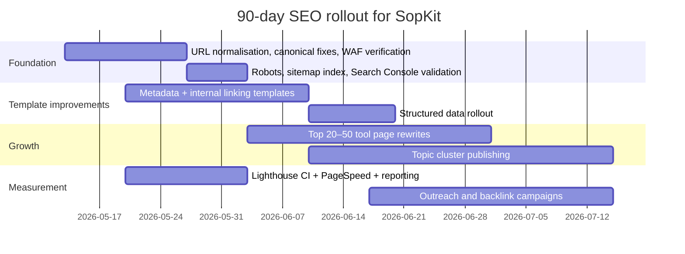

# SopKit SEO audit and growth plan

## Executive summary

urlSopKithttps://sopkit.github.io/ already has a strong product premise: a large library of browser-based utilities across image, PDF, video, developer, utility, audio, fun-generator, and SEO categories. Search snippets show materially different site states over time — “135+ free online tools”, “150+ tools”, “200+ free tools”, and “600+ power tools” — which suggests rapid growth but also inconsistent metadata and messaging across indexed versions. I also found a duplicate home URL variant indexed as `//`, which is a classic canonicalisation and URL-normalisation problem. Those two issues alone can dilute relevance, CTR, and crawl efficiency. citeturn28search0turn10search1turn10search0turn2search1

The strongest upside is not “generic SEO everywhere”; it is disciplined consolidation around the highest-trust, highest-linkability clusters: image optimisation, PDF workflows, developer utilities, and SEO diagnostics. Those clusters match both user intent and the site’s current footprint. By contrast, the social-media downloader cluster may drive traffic, but it is less defensible, less linkable, and more likely to generate low-trust brand signals than evergreen productivity utilities. That means the best path to top-of-Google outcomes is to (a) fix crawl/indexation hygiene, (b) standardise metadata and internal linking, (c) deepen the top 20–50 tool pages with genuinely differentiated content, and (d) build editorial topic clusters and backlinks around privacy-first, browser-based tooling. citeturn10search0turn25search0turn25search2

Two caveats matter. First, my direct fetch of the home page returned an unexpected status, while search results and uptime tools still showed the site indexed and reachable. That points to a likely crawler/WAF inconsistency that must be verified in server logs and with the URL Inspection tooling in urlGoogle Search Consoleturn23search6. Second, the public urlGitHubhttps://github.com repository URL could not be confirmed from the web, even though the site’s search snippet clearly exposes footer links labelled “GitHub Repository”, “Contribute & Build”, and “Report an Issue”. The CI/CD review below is therefore partly inference-based and should be validated once the repository URL is available. citeturn3view0turn8search1turn8search0turn22search9

No legitimate SEO process can guarantee a permanent number-one ranking for every target term; even urlGoogle Search Centralturn25search2 says there are no secrets that automatically rank a site first. What you can do is materially improve eligibility, crawlability, relevance, snippet quality, authority, and page experience — and those are the levers most likely to move SopKit into top-three or top-ten positions for its best-fit keyword clusters. citeturn25search2turn24search1

## Crawl footprint and current findings

The live site appears to be a large, template-driven tools platform. Search snippets expose major category groupings and several tool URLs with clear search intent: image compression, PDF merging, website analysis, keyword rank checking, backlink checking, sitemap generation, and more. The homepage snippet also shows an SEO-tools section, which is strategically useful because it can double as both product surface area and acquisition loop for marketers and site owners. citeturn10search0turn11search0turn11search1turn14search4

Because direct fetches were unreliable in this audit environment, the table below is a **high-confidence discovered-map**, not a full export of every public URL. The right way to validate the complete crawl is with a live crawl from your own environment plus XML sitemap submission and URL Inspection checks in urlGoogle Search Consoleturn23search6. Google’s own documentation recommends sitemaps for discovery and documents how technical requirements, status codes, robots rules, and canonical signals interact with crawling and indexing. citeturn19search2turn19search4turn19search5turn19search6

| URL | Page type | Evidence | Observed status / issue | What it means |
|---|---|---|---|---|
| url/https://sopkit.github.io/ | Homepage | Search snippet + third-party status panel | Indexed; one third-party panel reports HTTP 200, but my direct fetch hit an unexpected status | Possible WAF / bot-handling inconsistency; verify Googlebot access and monitoring compatibility. citeturn10search0turn28search0turn3view0 |
| url//https://sopkit.github.io// | Duplicate homepage variant | Separate indexed result | Duplicate URL variant visible in search result | Strong signal to enforce URL normalisation and canonicalisation. citeturn10search1turn19search1 |
| url/image-compressorhttps://sopkit.github.io/image-compressor | Tool landing page | Search result with title/body copy | Indexed; status not independently verified | One of the most commercially valuable evergreen pages. citeturn11search1 |
| url/pdf-mergerhttps://sopkit.github.io/pdf-merger | Tool landing page | Search result with title/body copy | Indexed; status not independently verified | Another core evergreen utility page with high-intent search demand. citeturn11search0 |
| url/website-analyzerhttps://sopkit.github.io/website-analyzer | SEO tool landing page | Search result with title/body copy | Indexed; status not independently verified | High-value B2B/marketer acquisition page. citeturn14search4 |

The crawl map also surfaces an important messaging problem: different indexed variants advertise materially different tool counts and homepage copy. That is not automatically harmful if older snippets are simply lagging behind recent changes, but it often correlates with unstable title templates, weak canonical signals, or rerendered content states that Google does not consolidate cleanly. Stabilising homepage and top-category metadata is therefore a first-priority clean-up. citeturn28search0turn10search1turn10search0turn2search1

## Technical SEO

The biggest technical concern is URL normalisation. An indexed `https://sopkit.github.io//` result strongly suggests that either duplicate variants are reachable, internal links or sitemap entries are malformed, or canonical tags are not consistently consolidating to the preferred root URL. urlGoogle Search Central canonical guidanceturn19search1 says the strongest canonical signals are redirects and `rel="canonical"`, with sitemap inclusion as a weaker signal; it also explicitly recommends linking internally to canonical URLs. Your first job is to ensure every non-preferred variant — double-slash paths, stray trailing-slash inconsistencies, uppercase variants if any, parameter noise, and protocol/host variants — 301s to a single preferred URL, and that every indexable page emits one matching canonical. citeturn10search1turn19search1turn19search0

The second technical concern is crawler compatibility. In this audit, the homepage could not be fetched directly, yet external status tooling still reported the site up, and search results still exposed current content. That usually points to edge logic, bot management, or rate limiting behaving differently by user agent, geography, or request pattern. Google’s technical requirements stress that pages must be accessible to Googlebot, while the URL Inspection API exists precisely so teams can debug how Google sees specific URLs. Action: check Cloudflare bot settings, challenge rules, and server logs; confirm that Googlebot, PageSpeed, Lighthouse, uptime monitors, and ad-hoc crawlers are not being blocked or served divergent responses. citeturn3view0turn8search1turn19search2turn22search9

Third: robots.txt and sitemap discipline. I could not independently verify the live `robots.txt` or XML sitemap in this environment, so treat this as an **open verification item** rather than a confirmed fault. Still, urlGoogle Search Central sitemap guidanceturn19search5 and urlrobots.txt guidanceturn19search4 are clear: large sites should expose a root-level robots file, a discoverable XML sitemap, and only canonical URLs in that sitemap. Given the scale of SopKit, I would create a sitemap index split by template class: home, categories, tools, editorial content, and any locale variants. Then submit and monitor those in the Sitemaps section of urlGoogle Search Consoleturn23search6. citeturn19search4turn19search5turn23search1

Fourth: page experience and mobile readiness. urlGoogle Search Central Core Web Vitals guidanceturn24search0 recommends LCP under 2.5 seconds, INP under 200 milliseconds, and CLS under 0.1; its page-experience guidance also explicitly asks whether content displays well on mobile devices. Because I could not pull current official PageSpeed results for the live site from this environment, I am not assigning a current PSI score. Instead, the operational recommendation is to benchmark homepage, top category pages, and the top 20 tool templates with both the official urlPageSpeed Insights API docsturn20search10 and urlLighthouse CIturn21search5. citeturn24search0turn24search1turn24search3turn20search10

Fifth: structured data. I could not verify the current live markup, so I am treating this as an implementation gap until proven otherwise. urlGoogle Search Central structured data documentationturn20search4 recommends JSON-LD and explains that valid markup can improve rich result eligibility. For SopKit, the pragmatic stack is: `Organization` and `WebSite` on the homepage, `BreadcrumbList` on category and tool pages, and optionally `HowTo`-style editorial content where appropriate. Do **not** overinvest in `FAQPage` for standard tool pages; Google says FAQ rich results are now limited to government-focused and health-focused authoritative sites. citeturn20search4turn20search0turn20search1turn20search12

Finally: hreflang. Since the brief assumes English, there is no need to deploy `hreflang` unless you launch genuine locale or language variants. If you later create `en-gb`, `en-us`, or translated pages, Google requires fully qualified alternate URLs, self-referencing entries, and reciprocal return links; otherwise the annotations may be ignored. citeturn26search0turn26search5turn26search7

## On-page SEO and information architecture

The on-page pattern today looks promising but uneven. The good news is that tool pages like url/image-compressorhttps://sopkit.github.io/image-compressor and url/pdf-mergerhttps://sopkit.github.io/pdf-merger already use intent-aligned titles and explanatory copy that matches core user tasks. The mediocre news is that many homepage snippet fragments expose generic boilerplate such as “Free [tool] tool to process your data instantly with privacy-friendly browser-based workflows.” That kind of repeated template language scales fast, but it also creates thin differentiation between pages that should be competing on specific intent, examples, output formats, and use cases. Google’s people-first content guidance explicitly warns against mass-produced content that adds little value beyond generic rewrites. citeturn11search0turn11search1turn10search0turn25search0

The home page and category architecture need clearer hierarchy. Search snippets show that the homepage already groups tools into Image, PDF, Video, Social Media Downloaders, Audio, Utility, Developer, Fun Generators, and SEO. That is good raw material for a hub-and-spoke model. The missing piece is stronger category landing pages with unique copy, use-case explanations, comparisons, and “related tools” blocks that push users and crawlers deeper into the cluster. urlGoogle Search Console Links report docsturn27search0 note that internal links help confirm which pages are core to the site; SopKit should deliberately make category hubs and the strongest tool pages the most internally linked URLs outside the homepage. citeturn10search0turn27search0

A practical keyword map for the first wave should look like this:

| Cluster | Search intent | Recommended primary page | Supporting pages |
|---|---|---|---|
| Image compression | Utility / transactional | url/image-compressorhttps://sopkit.github.io/image-compressor | Compress to 100KB, JPG to WebP, batch compression, image optimiser comparison |
| PDF merging | Utility / transactional | url/pdf-mergerhttps://sopkit.github.io/pdf-merger | PDF split vs merge, merge large PDFs, browser-based PDF privacy |
| Website analysis / SEO audit | Diagnostic / commercial | url/website-analyzerhttps://sopkit.github.io/website-analyzer | Technical SEO checklist, Core Web Vitals explainer, sitemap and robots guides |
| Backlink / rank tracking | Diagnostic / commercial | Dedicated tool pages | Bulk rank tracking guide, backlink audit guide, competitor benchmark templates |
| Developer utilities | Utility / informational | Category hub | JSON formatter, Base64, HTML minifier, UUID, UTM builder comparisons |

This mapping is aligned with Google’s SEO starter guidance and people-first content guidance: build pages that are easy for users and search engines to understand; do not flood the index with undifferentiated, templated pages. citeturn25search2turn25search0

My title/meta recommendation is simple: freeze a site-wide title framework for the top templates. Use the strongest exact-match term first, add one specific benefit, and keep the brand suffix stable. For example: “Image Compressor – Reduce JPG, PNG & WebP File Size Online | SopKit”. Then write meta descriptions as task-oriented summaries, not value-prop soup. Search Console’s performance report is the right place to measure whether impression-to-click rates improve after rewrites. citeturn20search7turn27search6turn20search15

## Content strategy and keyword clusters

The site’s biggest content gap is **editorial depth**, not tool count. Search results already show competitors publishing comparison posts, rankings, and use-case explainers around image compressors, PDF editors, PDF mergers, and SEO tools. SopKit appears to have the tools, but not yet the surrounding editorial moat that earns links, captures informational searches, and improves E-E-A-T signals. citeturn29search0turn29search4turn29search5turn29search8turn29search9

The fastest content win is a **pillar-and-spoke model** for four clusters:

| Pillar cluster | Pillar page | Spokes to publish next |
|---|---|---|
| Image optimisation | “Image Tools” category hub | Best image compressor, compress to exact KB, TinyPNG alternatives, Squoosh vs browser-based batch tools |
| PDF workflows | “PDF Tools” category hub | Best free PDF merger, PDF merge vs split explainer, secure browser-based PDF processing |
| SEO diagnostics | “SEO Tools” category hub | Technical SEO audit checklist, keyword rank checking guide, backlink checker use cases, sitemap troubleshooting |
| Developer utilities | “Developer Tools” category hub | JSON formatting guide, Base64 explained, UTM parameter builder guide, HTML minification best practices |

That approach is directly aligned with urlGoogle Search Console performance reportingturn20search7 and the Search Analytics API, which let you group queries and pages and discover what is already earning impressions. Start with impression-rich, click-poor queries in the performance report; those are your low-friction topics. Then use page-and-query exports to map support content to the tool pages already surfacing in Search. citeturn23search16turn23search9turn20search7

The editorial standard should be stricter than the current tool-page boilerplate. urlGoogle Search Central people-first content guidanceturn25search0 specifically favours original information, substantial descriptions, visible expertise, and content that leaves users satisfied. For SopKit, that means every new article should include first-hand tests, screenshots, before/after examples, benchmark tables, author/owner attribution, update dates that reflect real changes, and clear disclosure of how files are processed. That is especially effective for privacy-first positioning because many competing tools still upload files server-side. citeturn25search0turn29search4turn29search5turn29search7

A note on priorities: do not try to rank the entire domain at once. Pick 20–30 pages where (a) the intent is clear, (b) the SERP is not dominated by giant brands, and (c) the query is linkable and evergreen. “Image compressor”, “compress image to 100KB”, “PDF merger”, “UTM builder”, “JSON formatter”, “backlink checker”, and “SEO audit tool” are better long-term bets than the broad downloader cluster. citeturn11search1turn11search0turn10search0turn14search4

## Backlinks and competitors

Public third-party estimates suggest the domain is still early in authority building. urlSEMrushhttps://www.semrush.com estimated roughly 24.17K visits in March 2026, Authority Score 5, around 95 referring domains, and about 20.56K backlinks. Another third-party review also explicitly described the site as having limited third-party mentions and inbound links. Treat those numbers as directional, not canonical, but the conclusion is clear: authority is thin relative to the size of the site. citeturn28search2turn28search3

The most relevant **keyword-cluster competitors** are not one single site; they are a set of specialist leaders across the site’s strongest verticals:

| Competitor | Primary strength | Why they matter | Opportunity for SopKit |
|---|---|---|---|
| urlSmallpdfhttps://smallpdf.com | Browser PDF toolkit | Frequently cited in major PDF-merger/editor roundups | Out-position on privacy-first messaging and zero-signup workflows. citeturn29search8turn18news54 |
| urliLovePDFhttps://www.ilovepdf.com | Free browser PDF workflows | TechRadar calls it the top free browser-based merger in its PDF-merger roundup | Build cleaner landing pages and better educational support content around merge/split/compress use cases. citeturn29search8 |
| urlTinyPNGhttps://tinypng.com | Image compression brand recognition | Frequently appears in image-compressor comparison content | Differentiate on local processing, unlimited batch, and broader tool ecosystem. citeturn29search4turn29search5turn29search7 |
| urlSquooshhttps://squoosh.app | Advanced client-side image optimisation | Repeatedly cited as the power-user benchmark for browser image compression | Compete on batch workflows, simpler UX, and SEO-friendly tutorials. citeturn29search4turn29search5turn29search7 |
| urlAhrefshttps://ahrefs.com | SEO tooling and authority | Strong category authority in SEO tooling and reviews | SopKit can win on free utility pages and lightweight diagnostics rather than trying to match the full suite. citeturn29search9turn29news37 |

The backlink strategy should therefore be **editorial and product-led**, not generic link begging. The highest-value opportunities are:

| Link opportunity | What to pitch | Why it is high value |
|---|---|---|
| Editorial reviews and roundups on urlTechRadarhttps://www.techradar.com, urlLifewirehttps://www.lifewire.com, and similar publishers | Original benchmark content: privacy-first tools, browser-only processing, best free PDF/image workflows | These publishers already cover the exact problem spaces and shape buyer/searcher trust. citeturn29search8turn18news54turn29search6 |
| SEO software directories such as urlToolRadarhttps://toolradar.com and relevant product directories | Well-structured listings for the SEO toolkit and core utilities | These help with branded discovery and comparable-intent searches. citeturn29search9 |
| Comparison-content outreach | Publish “X alternatives” and first-hand test articles, then pitch them to newsletters and communities | Helps earn both links and long-tail rankings around alternatives and use-case queries. citeturn29search0turn29search4turn29search5 |
| Open-source / developer trust assets | Publish public docs, changelogs, roadmap, or repo once confirmed | GitHub-linked transparency can materially improve trust and organic referencing. citeturn8search0 |

Anchor-text guidance: keep anchors mostly branded and semi-branded. Search Console’s Links report is the right place to check whether external link text looks natural or spammy. citeturn27search0turn27search1

## Delivery plan, CI/CD and Notion automation

The order of operations matters more than the raw volume of work. Fix indexation and page-template hygiene first; publish new content second; scale outreach third.

| Priority | Task | Effort | Impact | KPI |
|---|---|---|---|---|
| P0 | Force 301 redirects for `//` and any non-preferred URL variants; align canonicals and sitemap entries | M | Very high | Duplicate root variants removed from index; one preferred homepage URL only. citeturn10search1turn19search1 |
| P0 | Verify Googlebot, PSI, and Lighthouse can fetch templates through edge/WAF rules | M | Very high | Successful URL Inspection fetches; no blocked-template diagnostics. citeturn3view0turn22search9 |
| P0 | Audit and submit robots.txt + sitemap index in Search Console | S | High | Sitemap coverage ratio, submitted-vs-indexed trend. citeturn19search4turn19search5turn23search1 |
| P0 | Standardise title, meta description, H1, canonical, and OG templates for homepage, category, and top 50 tool pages | M | High | CTR increase on top pages in Search Console. citeturn20search7turn27search6 |
| P1 | Add category hubs, related-tools modules, breadcrumbs, and stronger internal linking | M | High | Internal-link prominence for category hubs and top money pages. citeturn27search0 |
| P1 | Deepen top 20–50 tools with unique use cases, comparisons, examples, and better formatting | H | High | Improved rankings for primary head terms and longer session depth. citeturn25search0 |
| P1 | Implement JSON-LD for WebSite / Organization / BreadcrumbList where appropriate | S | Medium | Rich result validation passes; enhancement reports appear in Search Console. citeturn20search0turn20search4turn27search3 |
| P1 | Stand up a weekly performance pipeline with PageSpeed + Lighthouse CI in CI/CD | S | High | Budget failures caught on PRs; CWV trendline improves. citeturn20search10turn21search5turn21search3turn22search0 |
| P2 | Publish four topic clusters and begin editorial outreach | H | High | New referring domains, non-brand impressions, content-assisted conversions. citeturn28search2turn25search0 |
| P2 | Confirm and operationalise public GitHub / open-source assets if available | M | Medium | Brand mentions, trust signals, developer links. citeturn8search0 |

A realistic 90-day timeline is below.



The most important KPIs should come from official Google tooling first and third-party tools second. Use urlGoogle Search Consoleturn23search6 for clicks, impressions, CTR, pages, queries, links, HTTPS, and rich-result health; use the official urlPageSpeed Insights API docsturn20search10 and urlLighthouse CI docsturn21search5 for performance budgets; use third-party suites such as urlSEMrushhttps://www.semrush.com or Ahrefs only as directional external benchmarks. citeturn20search7turn27search0turn27search5turn27search3turn20search10turn21search5

### CI/CD and GitHub review

The public repository URL is still unconfirmed, but the site snippet’s footer proves a GitHub link almost certainly exists. Based on the site’s scale and page-template pattern, the build should generate all SEO-critical metadata **at build time or server-side**, not rely on late client-side mutation. The repository, once found, should be checked for these SEO-sensitive items first: route generation, sitemap generation, robots generation, canonical helpers, title/description templating, Open Graph image logic, JSON-LD components, and any edge middleware rewriting URLs. citeturn8search0turn19search2

A baseline CI workflow should use urlGitHub Actions docsturn21search3, dependency caching, and Lighthouse CI. GitHub documents dependency caching; Lighthouse CI has both a GitHub App and marketplace action for PR feedback. citeturn21search3turn22search0turn22search2turn21search1turn21search5

```yaml
name: seo-ci
on:
  push:
    branches: [main]
  pull_request:
  schedule:
    - cron: "0 3 * * 1"

jobs:
  build-and-audit:
    runs-on: ubuntu-latest
    steps:
      - uses: actions/checkout@v4

      - uses: actions/setup-node@v4
        with:
          node-version: 20
          cache: npm

      - run: npm ci
      - run: npm run build

      # Optional: generate sitemap/robots as part of the build
      - run: npm run export:sitemaps

      # Lighthouse CI
      - run: npx @lhci/cli autorun
        env:
          LHCI_GITHUB_APP_TOKEN: ${{ secrets.LHCI_GITHUB_APP_TOKEN }}
```

### Commands to reproduce scans

The official APIs and tools to wire into your own environment are documented by Google, GitHub, and Notion. The commands below are the fastest way to create a reproducible audit pipeline. citeturn20search10turn23search9turn21search5turn21search8turn21search4

```bash
# Basic reachability
curl -I https://sopkit.github.io/
curl -s https://sopkit.github.io/robots.txt
curl -s https://sopkit.github.io/sitemap.xml | head -100

# Lighthouse (local)
npx lighthouse https://sopkit.github.io/ \
  --preset=desktop \
  --output=json \
  --output=html \
  --output-path=./reports/SopKit-desktop

npx lighthouse https://sopkit.github.io/ \
  --preset=perf \
  --form-factor=mobile \
  --screenEmulation.mobile \
  --output=json \
  --output-path=./reports/SopKit-mobile.json

# PageSpeed Insights API
curl "https://pagespeedonline.googleapis.com/pagespeedonline/v5/runPagespeed?url=https://sopkit.github.io/&strategy=mobile&category=performance&category=accessibility&category=best-practices&category=seo"

# Search Console Search Analytics API
curl -X POST \
  "https://www.googleapis.com/webmasters/v3/sites/sc-domain:sopkit.github.io/searchAnalytics/query" \
  -H "Authorization: Bearer $ACCESS_TOKEN" \
  -H "Content-Type: application/json" \
  -d '{
    "startDate":"2026-04-01",
    "endDate":"2026-05-11",
    "dimensions":["query","page"],
    "rowLimit":25000
  }'
```

### Notion database schema

Because the modern urlNotion API docsturn21search8 split databases and data sources, the simplest production setup is: create the database in the Notion UI using the schema below, share it with your integration, then push rows into the database’s data source with the API. Creating pages under a database now uses `data_source_id`. citeturn21search8turn21search11turn21search4

| Field | Type | Required | Purpose |
|---|---|---|---|
| Name | Title | Yes | Human-readable finding or task name |
| Item type | Select | Yes | Finding / Task / Competitor / Opportunity / KPI |
| URL | URL | No | Affected page or target page |
| Section | Select | Yes | Technical / On-page / Content / Links / CI/CD / Analytics |
| Priority | Select | Yes | P0 / P1 / P2 |
| Status | Select | Yes | Backlog / In progress / Blocked / Done |
| Effort | Select | Yes | S / M / L / XL |
| Impact | Select | Yes | Low / Medium / High / Very high |
| KPI | Rich text | No | Metric that this item should move |
| Target | Rich text | No | Numerical or directional target |
| Recommendation | Rich text | Yes | What to do |
| Evidence | Rich text | No | Notes, snippets, citations, observed issue |
| Due date | Date | No | Operational planning |
| Owner | Rich text | No | Person or team responsible |
| Tags | Multi-select | No | Cluster tags such as image / pdf / seo / developer |

### Node.js script to push audit items into Notion

```bash
npm install @notionhq/client dotenv
```

```js
// push-seo-audit-to-notion.mjs
import 'dotenv/config'
import fs from 'node:fs'
import { Client } from '@notionhq/client'

const notion = new Client({ auth: process.env.NOTION_API_KEY })
const dataSourceId = process.env.NOTION_DATA_SOURCE_ID

if (!dataSourceId) {
  throw new Error('Missing NOTION_DATA_SOURCE_ID')
}

const items = JSON.parse(fs.readFileSync('./seo-audit-items.json', 'utf8'))

const rt = (text = '') => ({
  rich_text: [{ type: 'text', text: { content: String(text).slice(0, 1900) } }]
})

const title = (text) => ({
  title: [{ type: 'text', text: { content: String(text).slice(0, 1900) } }]
})

const select = (name) => (name ? { select: { name } } : undefined)
const multiSelect = (arr = []) =>
  arr.length ? { multi_select: arr.map((name) => ({ name })) } : undefined
const url = (value) => (value ? { url: value } : undefined)
const date = (value) => (value ? { date: { start: value } } : undefined)

async function createPage(item) {
  const properties = {
    Name: title(item.name),
    'Item type': select(item.itemType),
    URL: url(item.url),
    Section: select(item.section),
    Priority: select(item.priority),
    Status: select(item.status || 'Backlog'),
    Effort: select(item.effort),
    Impact: select(item.impact),
    KPI: rt(item.kpi),
    Target: rt(item.target),
    Recommendation: rt(item.recommendation),
    Evidence: rt(item.evidence),
    'Due date': date(item.dueDate),
    Owner: rt(item.owner),
    Tags: multiSelect(item.tags || [])
  }

  // Remove undefined properties to avoid validation errors
  for (const key of Object.keys(properties)) {
    if (properties[key] === undefined) delete properties[key]
  }

  return notion.pages.create({
    parent: { data_source_id: dataSourceId },
    properties
  })
}

async function main() {
  for (const item of items) {
    await createPage(item)
    console.log(`Created: ${item.name}`)
  }
  console.log(`Done. Created ${items.length} Notion pages.`)
}

main().catch((err) => {
  console.error(err)
  process.exit(1)
})
```

```json
[
  {
    "name": "Fix duplicate homepage URL variant",
    "itemType": "Task",
    "url": "https://sopkit.github.io//",
    "section": "Technical",
    "priority": "P0",
    "status": "Backlog",
    "effort": "M",
    "impact": "Very high",
    "kpi": "Duplicate URLs indexed",
    "target": "0 duplicate homepage variants",
    "recommendation": "301 redirect all non-preferred root variants to https://sopkit.github.io/ and align rel=canonical + sitemap entries.",
    "evidence": "Indexed duplicate root variant observed in search results.",
    "dueDate": "2026-05-20",
    "owner": "Engineering",
    "tags": ["canonical", "crawl", "home"]
  },
  {
    "name": "Improve image compressor landing page",
    "itemType": "Finding",
    "url": "https://sopkit.github.io/image-compressor",
    "section": "On-page",
    "priority": "P1",
    "status": "Backlog",
    "effort": "M",
    "impact": "High",
    "kpi": "CTR and average rank",
    "target": "+20% CTR on primary query set",
    "recommendation": "Expand with use cases, before/after examples, exact file-size workflows, related tools, and competitor comparisons.",
    "evidence": "High-intent evergreen page already indexed.",
    "dueDate": "2026-06-05",
    "owner": "SEO / Content",
    "tags": ["image", "landing-page", "evergreen"]
  }
]
```

## Open questions and limitations

This audit is high-confidence on strategy, canonical risk, crawl hygiene priorities, information architecture, editorial direction, and measurement stack. It is **not** a full forensic crawl because the live origin behaved inconsistently for direct fetches in this environment. Specifically, I could not independently validate the live `robots.txt`, `sitemap.xml`, full HTTP-status map, current canonical tags, or current JSON-LD output. The first implementation sprint should therefore begin by capturing those from your own environment and from urlGoogle Search Consoleturn23search6, then reconciling them against this plan. citeturn3view0turn19search2turn19search4turn19search5turn23search6

I also could not confirm the public urlGitHubhttps://github.com repository URL from the web, despite the site snippet showing that such a link exists. Once you surface that repository URL, the next pass should validate actual route generation, metadata generation, deployment targets, sitemap code, redirect rules, structured-data components, and CI workflows directly in source. citeturn8search0