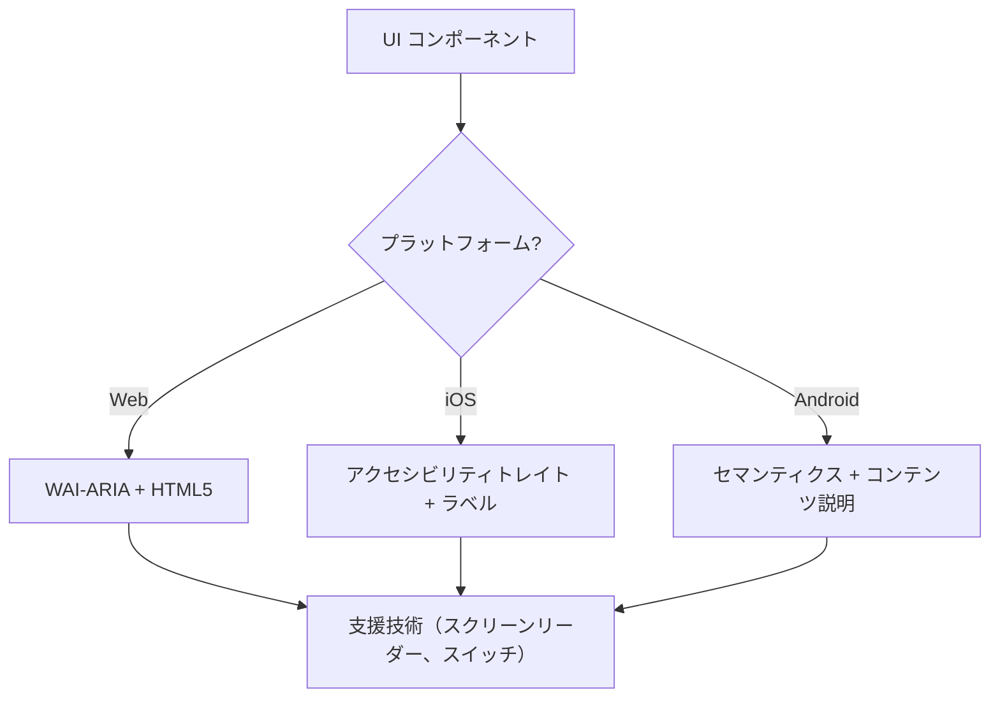

# アクセシビリティ（WCAG 2.2）

このスキルは、スクリーンリーダー、スイッチコントロール、キーボードナビゲーションを使用するユーザーを含む、すべてのユーザーにとってデジタルインターフェースが知覚可能・操作可能・理解可能・堅牢（POUR）であることを保証します。WCAG 2.2 達成基準の技術的な実装に焦点を当てています。

## 使用タイミング

- Web、iOS、Android 向け UI コンポーネント仕様の定義。
- アクセシビリティの障壁やコンプライアンスのギャップについて既存コードを監査する。
- Target Size（最小）や Focus Appearance など新しい WCAG 2.2 基準を実装する。
- 高水準な設計要件を技術属性（ARIA ロール、トレイト、ヒント）にマッピングする。

## コアコンセプト

- **POUR 原則**: WCAG の基盤（知覚可能・操作可能・理解可能・堅牢）。
- **セマンティックマッピング**: 汎用コンテナよりネイティブ要素を使用して組み込みのアクセシビリティを提供する。
- **アクセシビリティツリー**: 支援技術が実際に「読み取る」UI の表現。
- **フォーカス管理**: キーボード・スクリーンリーダーカーソルの順序と可視性を制御する。
- **ラベリングとヒント**: `aria-label`、`accessibilityLabel`、`contentDescription` を通じてコンテキストを提供する。

## 仕組み

### ステップ 1: コンポーネントロールの特定

機能的な目的を決定します（例：これはボタンか、リンクか、タブか）。カスタムロールに頼る前に、利用可能な最もセマンティックなネイティブ要素を使用します。

### ステップ 2: 知覚可能属性の定義

- テキストのコントラストが **4.5:1**（通常）または **3:1**（大きいテキスト・UI）を満たすことを確認。
- 非テキストコンテンツ（画像、アイコン）にテキスト代替を追加。
- レスポンシブリフロー（機能を損なわずに最大 400% ズーム）を実装。

### ステップ 3: 操作可能なコントロールの実装

- 最小 **24x24 CSS ピクセル**のターゲットサイズを確保（WCAG 2.2 SC 2.5.8）。
- すべてのインタラクティブ要素がキーボードで到達可能で、可視のフォーカスインジケーターを持つことを確認（SC 2.4.11）。
- ドラッグ操作の単一ポインター代替手段を提供。

### ステップ 4: 理解可能なロジックの確保

- 一貫したナビゲーションパターンを使用。
- 修正のための説明的なエラーメッセージと提案を提供（SC 3.3.3）。
- 同じデータを二度求めないよう「冗長入力防止」（SC 3.3.7）を実装。

### ステップ 5: 堅牢な互換性の検証

- 正しい `Name, Role, Value` パターンを使用。
- 動的なステータス更新のために `aria-live` またはライブリージョンを実装。

## アクセシビリティアーキテクチャ図



## クロスプラットフォームマッピング

| 機能                   | Web (HTML/ARIA)          | iOS (SwiftUI)                        | Android (Compose)                                           |
| :----------------- | :----------------------- | :----------------------------------- | :---------------------------------------------------------- |
| **プライマリラベル**  | `aria-label` / `<label>` | `.accessibilityLabel()`              | `contentDescription`                                        |
| **セカンダリヒント** | `aria-describedby`       | `.accessibilityHint()`               | `Modifier.semantics { stateDescription = ... }`             |
| **アクションロール**    | `role="button"`          | `.accessibilityAddTraits(.isButton)` | `Modifier.semantics { role = Role.Button }`                 |
| **ライブ更新**   | `aria-live="polite"`     | `.accessibilityLiveRegion(.polite)`  | `Modifier.semantics { liveRegion = LiveRegionMode.Polite }` |

## 例

### Web: アクセシブルな検索

```html
<form role="search">
  <label for="search-input" class="sr-only">Search products</label>
  <input type="search" id="search-input" placeholder="Search..." />
  <button type="submit" aria-label="Submit Search">
    <svg aria-hidden="true">...</svg>
  </button>
</form>
```

### iOS: アクセシブルなアクションボタン

```swift
Button(action: deleteItem) {
    Image(systemName: "trash")
}
.accessibilityLabel("Delete item")
.accessibilityHint("Permanently removes this item from your list")
.accessibilityAddTraits(.isButton)
```

### Android: アクセシブルなトグル

```kotlin
Switch(
    checked = isEnabled,
    onCheckedChange = { onToggle() },
    modifier = Modifier.semantics {
        contentDescription = "Enable notifications"
    }
)
```

## 避けるべきアンチパターン

- **Div ボタン**: ロールとキーボードサポートを追加せずに `<div>` や `<span>` をクリックイベントに使用する。
- **色のみの意味**: エラーやステータスを色の変化_のみ_で示す（例：ボーダーを赤にする）。
- **モーダルフォーカスの未封じ込め**: フォーカスをトラップしないモーダルで、キーボードユーザーがモーダル開放中に背景コンテンツをナビゲートできてしまう。フォーカスは封じ込め_かつ_`Escape` キーまたは明示的な閉じるボタンで脱出可能でなければならない（WCAG SC 2.1.2）。
- **冗長な代替テキスト**: alt テキストに「Image of...」や「Picture of...」を使用する（スクリーンリーダーはすでに「画像」というロールをアナウンスする）。

## ベストプラクティスチェックリスト

- [ ] インタラクティブ要素が **24x24px**（Web）または **44x44pt**（ネイティブ）のターゲットサイズを満たしている。
- [ ] フォーカスインジケーターが明確に見え、高コントラストである。
- [ ] モーダルは開いている間**フォーカスを封じ込め**、閉じる際にクリーンに解放する（`Escape` キーまたは閉じるボタン）。
- [ ] ドロップダウンとメニューは閉じる際にトリガー要素にフォーカスを戻す。
- [ ] フォームはテキストベースのエラー提案を提供する。
- [ ] アイコンのみのボタンには説明的なテキストラベルがある。
- [ ] テキストが拡大縮小されるとコンテンツが適切にリフローする。

## 参考資料

- [WCAG 2.2 ガイドライン](https://www.w3.org/TR/WCAG22/)
- [WAI-ARIA オーサリング実践](https://www.w3.org/TR/wai-aria-practices/)
- [iOS アクセシビリティプログラミングガイド](https://developer.apple.com/documentation/accessibility)
- [iOS ヒューマンインターフェースガイドライン - アクセシビリティ](https://developer.apple.com/design/human-interface-guidelines/accessibility)
- [Android アクセシビリティ開発者ガイド](https://developer.android.com/guide/topics/ui/accessibility)

## 関連スキル

- `frontend-patterns`
- `design-system`
- `liquid-glass-design`
- `swiftui-patterns`
