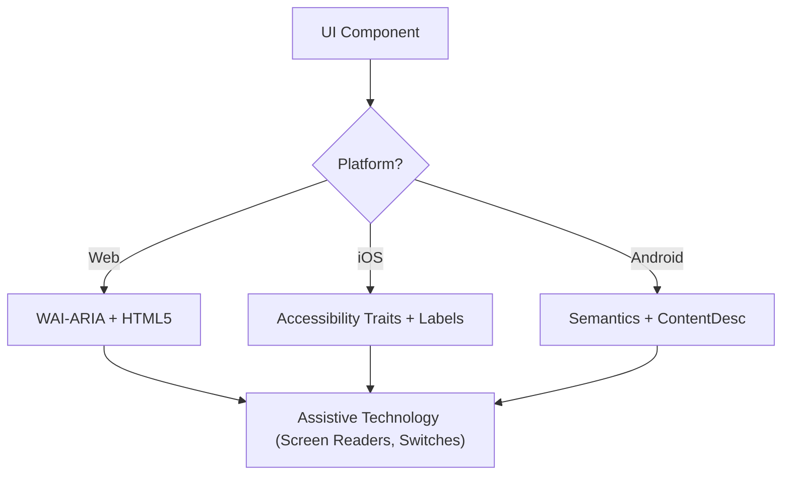

# 无障碍性（WCAG 2.2）

本技能确保数字界面对于所有用户（包括使用屏幕阅读器、开关控制或键盘导航的用户）具有可感知性、可操作性、可理解性和健壮性（POUR）。它专注于 WCAG 2.2 成功标准的技术实现。

## 使用时机

* 定义 Web、iOS 或 Android 的 UI 组件规范。
* 审计现有代码中的无障碍性障碍或合规性差距。
* 实现新的 WCAG 2.2 标准，如目标尺寸（最小）和焦点外观。
* 将高层设计需求映射到技术属性（ARIA 角色、特性、提示）。

## 核心概念

* **POUR 原则**：WCAG 的基础（可感知、可操作、可理解、健壮）。
* **语义映射**：使用原生元素而非通用容器，以提供内置的无障碍性。
* **无障碍树**：辅助技术实际“读取”的 UI 表示。
* **焦点管理**：控制键盘/屏幕阅读器光标的顺序和可见性。
* **标签与提示**：通过 `aria-label`、`accessibilityLabel` 和 `contentDescription` 提供上下文。

## 工作原理

### 步骤 1：识别组件角色

确定功能目的（例如，这是按钮、链接还是标签页？）。在诉诸自定义角色之前，优先使用最语义化的原生元素。

### 步骤 2：定义可感知属性

* 确保文本对比度达到 **4.5:1**（正常文本）或 **3:1**（大文本/UI 组件）。
* 为非文本内容（图像、图标）添加文本替代方案。
* 实现响应式重排（放大至 400% 时功能不丢失）。

### 步骤 3：实现可操作控件

* 确保最小 **24x24 CSS 像素** 的目标尺寸（WCAG 2.2 SC 2.5.8）。
* 验证所有交互元素可通过键盘访问，并具有可见的焦点指示器（SC 2.4.11）。
* 为拖拽操作提供单指针替代方案。

### 步骤 4：确保可理解逻辑

* 使用一致的导航模式。
* 提供描述性错误消息和更正建议（SC 3.3.3）。
* 实现“冗余输入”（SC 3.3.7），避免重复询问相同数据。

### 步骤 5：验证健壮兼容性

* 使用正确的 `Name, Role, Value` 模式。
* 为动态状态更新实现 `aria-live` 或活动区域。

## 无障碍架构图



## 跨平台映射

| 特性             | Web (HTML/ARIA)          | iOS (SwiftUI)                        | Android (Compose)                                           |
| :--------------- | :----------------------- | :----------------------------------- | :---------------------------------------------------------- |
| **主标签**       | `aria-label` / `<label>` | `.accessibilityLabel()`              | `contentDescription`                                        |
| **辅助提示**     | `aria-describedby`       | `.accessibilityHint()`               | `Modifier.semantics { stateDescription = ... }`             |
| **操作角色**     | `role="button"`          | `.accessibilityAddTraits(.isButton)` | `Modifier.semantics { role = Role.Button }`                 |
| **实时更新**     | `aria-live="polite"`     | `.accessibilityLiveRegion(.polite)`  | `Modifier.semantics { liveRegion = LiveRegionMode.Polite }` |

## 示例

### Web：无障碍搜索

```html
<form role="search">
  <label for="search-input" class="sr-only">Search products</label>
  <input type="search" id="search-input" placeholder="Search..." />
  <button type="submit" aria-label="Submit Search">
    <svg aria-hidden="true">...</svg>
  </button>
</form>
```

### iOS：无障碍操作按钮

```swift
Button(action: deleteItem) {
    Image(systemName: "trash")
}
.accessibilityLabel("Delete item")
.accessibilityHint("Permanently removes this item from your list")
.accessibilityAddTraits(.isButton)
```

### Android：无障碍切换开关

```kotlin
Switch(
    checked = isEnabled,
    onCheckedChange = { onToggle() },
    modifier = Modifier.semantics {
        contentDescription = "Enable notifications"
    }
)
```

## 应避免的反模式

* **Div 按钮**：使用 `<div>` 或 `<span>` 处理点击事件，但未添加角色和键盘支持。
* **仅用颜色传达含义**：仅通过颜色变化（例如，将边框变为红色）来指示错误或状态。
* **未限制的模态焦点**：模态框未限制焦点，导致键盘用户在模态框打开时仍可导航背景内容。焦点必须被限制，并且可通过 `Escape` 键或显式关闭按钮退出（WCAG SC 2.1.2）。
* **冗余替代文本**：在替代文本中使用“图像...”或“图片...”（屏幕阅读器已宣布“图像”角色）。

## 最佳实践检查清单

* \[ ] 交互元素满足 **24x24px**（Web）或 **44x44pt**（原生）的目标尺寸。
* \[ ] 焦点指示器清晰可见且高对比度。
* \[ ] 模态框在打开时**限制焦点**，并在关闭时干净地释放焦点（`Escape` 键或关闭按钮）。
* \[ ] 下拉菜单和菜单在关闭时将焦点恢复到触发元素。
* \[ ] 表单提供基于文本的错误建议。
* \[ ] 所有仅图标按钮都有描述性文本标签。
* \[ ] 文本缩放时内容正确重排。

## 参考

* [WCAG 2.2 指南](https://www.w3.org/TR/WCAG22/)
* [WAI-ARIA 创作实践](https://www.w3.org/TR/wai-aria-practices/)
* [iOS 无障碍编程指南](https://developer.apple.com/documentation/accessibility)
* [iOS 人机界面指南 - 无障碍](https://developer.apple.com/design/human-interface-guidelines/accessibility)
* [Android 无障碍开发者指南](https://developer.android.com/guide/topics/ui/accessibility)

## 相关技能

* `frontend-patterns`
* `design-system`
* `liquid-glass-design`
* `swiftui-patterns`
