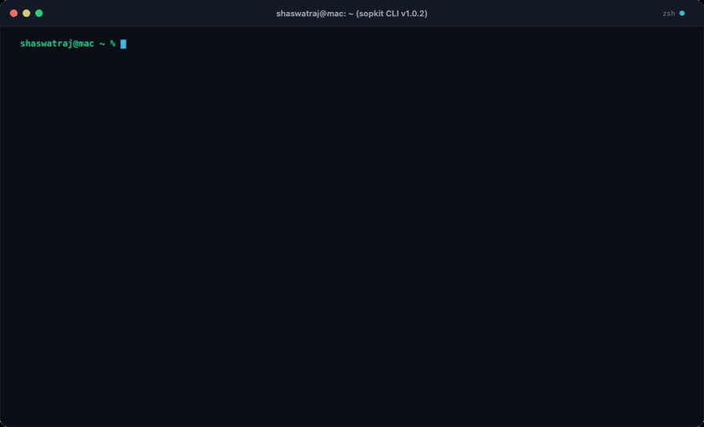

# `@sopkit/cli`

> **SopKit CLI — Fast, privacy-first developer utilities in your terminal.**

[](https://www.npmjs.com/package/@sopkit/cli)
[](https://github.com/SopKit/sopkit.github.io/blob/main/LICENSE)

Zero-dependency, standalone command-line interface bundled with the complete SopKit utility engine. Works both as an **interactive keyboard-navigated dashboard** and as **direct scriptable one-liners** for shell pipes and CI.

<div align="center">
  
</div>

Full web version available at: **[sopkit.space](https://sopkit.space/)**

---

## 🚀 Quickstart

### Option 1: Instant Run (Zero Installation via `npx`)
Run without installing anything:
```bash
# Launch visual interactive dashboard:
npx @sopkit/cli

# Run direct commands:
npx @sopkit/cli uuid v4 3
npx @sopkit/cli base64 encode "SopKit"
npx @sopkit/cli hash sha256 "secret"
npx @sopkit/cli slug "Love Calculator Story"
npx @sopkit/cli color "#ff3366"
npx @sopkit/cli password 24
```

### Option 2: Global Install (Enables `sopkit` command)
Install globally to use `sopkit` anywhere on your machine:
```bash
npm install -g @sopkit/cli

# Now use 'sopkit' directly:
sopkit
```

### Option 3: Local Repository Link (For Contributors)
If working inside the cloned `sopkit.github.io` repository:
```bash
# Link local build to your global PATH:
cd packages/cli && npm link && cd ../..

# Now run 'sopkit' directly:
sopkit uuid v4 3
```

---

## 🛠️ Direct CLI Commands

The CLI supports direct command-line arguments for fast shell integration and scripting:

```bash
# UUID Generation
sopkit uuid v4              # Single UUID v4
sopkit uuid v4 5            # Generate 5 UUIDs
sopkit uuid v1              # Timestamp-based UUID v1

# Base64 Encoding / Decoding
sopkit base64 encode "Hello World"
sopkit base64 decode "SGVsbG8gV29ybGQ="

# Cryptographic Hashing
sopkit hash sha256 "password123"
sopkit hash sha512 "data"
sopkit hash md5 "file-checksum"

# URL Slugs
sopkit slug "Top 10 Online Developer Tools in 2026!"
# Output: top-10-online-developer-tools-in-2026

# Colorspace Conversion
sopkit color "#10b981"
# Output: HEX: #10b981 | RGB: rgb(16, 185, 129) | HSL: hsl(160, 84%, 39%)

# Password Generator
sopkit password 32          # 32-character high entropy password

# Validation
sopkit validator email "dev@sopkit.space"
sopkit validator url "https://sopkit.space"
sopkit validator ip "192.168.1.1"
```

---

## 🎨 Interactive Terminal Dashboard

When executed with no arguments (`sopkit` or `npx @sopkit/cli`), the CLI displays a styled terminal UI:

```text
╭─────────────────────────────────────────────────────────────╮
│  S O P K I T  — Privacy-First Developer CLI                 │
│  600+ Browser & Terminal Utilities  https://sopkit.space    │
╰─────────────────────────────────────────────────────────────╯

? Choose a SopKit developer utility:
  ❯ 🔑  Hash Generator        (SHA-256, SHA-512, MD5, HMAC)
    📦  Base64 Engine         (Encode, Decode, URL-safe)
    🆔  UUID Generator        (v4 Random, v1 Timestamp)
    🔗  URL Slugify           (URL-safe, SEO-friendly slugs)
    🎨  Color Converter       (HEX, RGB, HSL conversions)
    🛡️   JWT Inspector         (Decode header & payload)
    ✨  JSON Formatter        (Beautify, Minify, Validate)
    📜  XML Formatter         (Beautify, Minify, Validate)
    🔒  Password Generator    (Strong entropy passwords)
    ✅  Data Validator        (Email, URL, IP, UUID, JSON)
    🚪  Exit
```

---

## 📦 Bundled Packages

All utilities are standalone, zero-dependency modules from the `@sopkit` ecosystem:

- `@sopkit/base64`
- `@sopkit/uuid`
- `@sopkit/slug`
- `@sopkit/json`
- `@sopkit/color`
- `@sopkit/validator`
- `@sopkit/password`
- `@sopkit/xml`
- `@sopkit/jwt`
- `@sopkit/hash`

---

## 📄 License
MIT © [SopKit](https://sopkit.space/)
