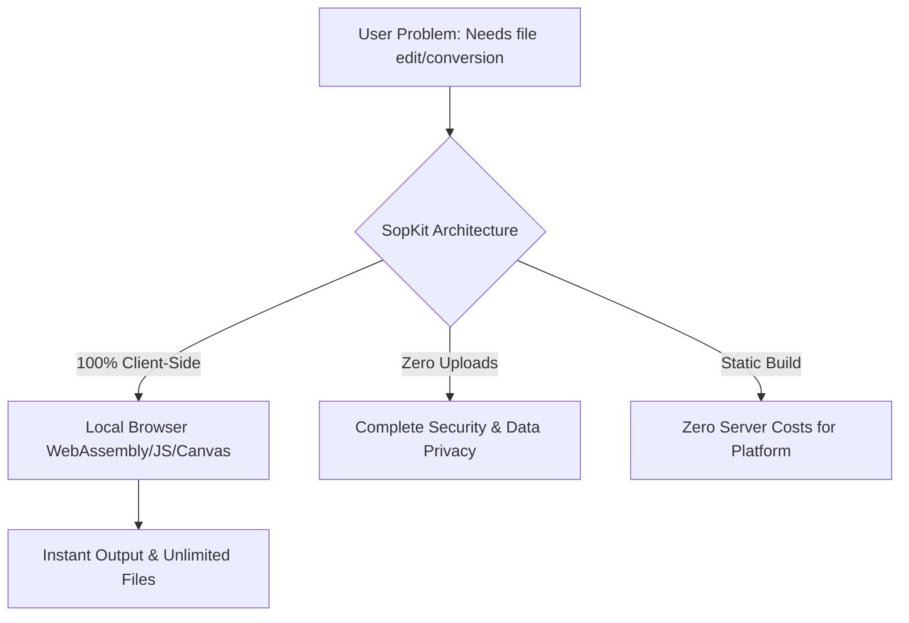

# SopKit — Deep Growth Research Analysis & Go-To-Market Playbook
*Author: Elite Startup Growth Strategist*
*Target Website:* [https://sopkit.github.io/](https://sopkit.github.io/)

---

## 1. Executive Summary

SopKit is uniquely positioned to disrupt the multi-billion-visit digital utility industry. While competitors like **TinyWow**, **iLovePDF**, and **CodeBeautify** capture hundreds of millions of visits monthly, they suffer from two critical architectural vulnerabilities: **unbounded cloud infrastructure costs** and **severe data privacy exposure**. By uploading user documents, images, and developer logs to remote cloud servers, these competitors face scaling overheads and exclude corporate, security-conscious, and enterprise users.

SopKit’s core competitive edge is its **100% client-side, browser-native architecture**. Every file conversion, image crop, PDF compression, and JSON format operation occurs entirely within the user's local browser sandbox. This analysis outlines a comprehensive blueprint to scale SopKit from its current baseline to **10 million+ monthly active users (MAUs)** without relying on paid advertising, utilizing programmatic SEO, AI search generative engine optimization (GEO), and product-led growth (PLG) loops.

---

## 2. Biggest Opportunities & Priority Matrix

To maximize growth velocity with minimal engineering friction, we prioritize strategies based on a scoring matrix: **Impact (1–10) × Effort (Inverse: 10 = easiest, 1 = hardest)**.

### Priority Matrix (Impact × Ease)
| Growth Initiative | Category | Impact (1-10) | Ease (1-10) | Score (Impact × Ease) | Priority |
| :--- | :--- | :--- | :--- | :--- | :--- |
| **Generative Engine Optimization (GEO) & llms.txt** | AI Search | 9.0 | 9.5 | **85.5** | **P0** |
| **"Zero-Upload" Security Positioning & Badging** | Product | 8.5 | 9.0 | **76.5** | **P0** |
| **Static HTML Programmatic Redirects Generation** | SEO | 9.5 | 8.0 | **76.0** | **P0** |
| **PWA & Chrome Web Store Extensions** | Distribution | 8.0 | 8.0 | **64.0** | **P1** |
| **Iframe Embeddable Widget Ecosystem** | Viral Loop | 8.5 | 7.0 | **59.5** | **P1** |
| **Raycast & Obsidian Developer Plugins** | Distribution | 7.5 | 7.5 | **56.2** | **P1** |
| **Local File Size Range Landing Pages** | pSEO | 8.0 | 7.0 | **56.0** | **P2** |
| **Government/Exam Photo Resizer Hubs** | SEO | 8.0 | 6.5 | **52.0** | **P2** |
| **SopKit CLI Tool & Node SDK** | Developer | 7.0 | 7.0 | **49.0** | **P3** |

---

## 3. Playbook Roadmap

### Phase 1 — Quick Wins (Week 1)
1. **Security & Privacy Trust Badge**: Inject a floating "100% Client-Side: Your Files Never Leave Your Device" badge onto every tool page. Explain the WebAssembly/Canvas local execution model.
2. **AI Search Indexing (llms.txt)**: Generate a `/llms.txt` and `/llms-full.txt` mapping of all tool descriptions to feed ChatGPT Search, Perplexity, Gemini, and Claude.
3. **PWA Integration**: Configure a standard Service Worker and manifest file so SopKit can be installed as an offline-first app for corporate environments.

### Phase 2 — Sprints (Months 1–3)
1. **Programmatic Redirect Deployment**: Execute `generate-redirects.cjs` to create static HTML redirect stubs for all 5,167 `extraSlugs` directly in the `out/` folder on compile.
2. **Launch Embeddable Widgets**: Allow third-party bloggers to embed tools (e.g., Base64 Decoder, Crop Tool) in their pages via clean `iframe` codes like `<iframe src="https://sopkit.github.io/embed/?id=base64"></iframe>`.
3. **Launch Chrome & Edge Extensions**: Package the core utilities as a manifest V3 browser extension mapping directly to the client-side files.

### Phase 3 — Long-Term (Months 6–12)
1. **Raycast / Alfred / MCP Servers**: Build developer launcher extensions and Model Context Protocol (MCP) servers so AI coding agents (like Claude or Cursor) can run local SopKit formatting tools.
2. **Corporate Offline Package**: Target corporate compliance officers by offering a compiled, offline-capable desktop package for enterprise intranets.

---

## 4. Product Analysis (Phase 1)

SopKit acts as a browser-native workspace for standard digital tasks. 



### Competitor Feature Gaps
*   **Security Gaps (Competitors)**: CloudConvert, TinyWow, and Sejda require network payloads to function. They can be forced to disclose user files or suffer data leaks.
*   **Feature Gaps (SopKit)**: Currently lacks batch file processing across all tools (needs a client-side queue utilizing JSZip) and lacks direct integrations (CLI, plugins).

---

## 5. Competitor Reverse Engineering (Phase 2)

We reverse-engineer the traffic, SEO, and business models of the top 20 utility platforms:

| Competitor | Monthly Traffic | Core SEO Keywords | Monetization Model | Viral / Growth Loop |
| :--- | :--- | :--- | :--- | :--- |
| **iLovePDF** | 120M+ | "merge pdf", "compress pdf" | Freemium Ads + Pro ($7/mo) | File sharing links / Multi-lingual localization |
| **TinyWow** | 2.4M | "pdf to word", "remove bg" | Freemium Ads + Pro ($5.99/mo) | No-signup friction-free sharing |
| **Smallpdf** | 50M | "edit pdf", "word to pdf" | Paid Paywalls (Free limit: 2/day) | Teams/Enterprise document signing links |
| **CloudConvert**| 18M | "convert file", "mov to mp4"| API Credits + Tiered Subscriptions | API references / Developer docs |
| **Convertio** | 25M | "convert doc", "png to svg" | File limit paywalls | Conversion settings links / API |
| **Photopea** | 15M | "photoshop online", "edit psd" | Ads + Ad-free Account ($5/mo) | Shareable PSD templates |
| **Remove.bg** | 40M | "remove background", "bg remover"| Pay-per-image credit system | API integrations / Photoshop plugins |
| **Canva** | 350M | "design templates", "logo maker" | Freemium Team Plan | Shared design links / Collaborative workspaces |
| **Ezgif** | 8M | "gif maker", "video to gif" | Banner ads only | Watermark-free user generation links |
| **Squoosh** | 1.2M | "compress image", "webp converter"| Free (Google Open Source) | Developer-to-developer recommendation |
| **ILoveIMG** | 15M | "resize image", "crop image" | Freemium Ads | Bulk image download sharing |
| **FreeConvert** | 12M | "mp4 to mp3", "video converter" | Ads + Conversion credit packs | Shared download pages |
| **PDF24** | 22M | "pdf tools offline", "pdf24" | Free (Desktop app promotion) | Free desktop client download |
| **Sejda** | 6M | "edit pdf online", "pdf editor" | Usage limits + Pro account | Shared links for editing templates |
| **RapidTables** | 5M | "percent calculator", "decimal to hex"| Ads only | Students sharing reference sheets |
| **CalculatorSoup**| 8M | "fraction calculator", "gpa calc"| Ads only | Teacher-to-student sharing loops |
| **Browserling** | 800K | "online browser test", "ie online"| Time limits + Developer premium | Interactive sandbox links |
| **JSONLint** | 1.5M | "json lint", "validate json" | Ads only | Developer forum copy-pastes |
| **CodeBeautify** | 4M | "json formatter", "xml beautify" | Ads only | Tool hub cross-linking |
| **TinyPNG** | 12M | "compress png", "shrink image" | Developer API credits | WordPress/Shopify plugins |

### Outperformance Strategy
SopKit can out-rank and out-grow these platforms by dominating **"Zero-Upload" search intents**. Developers and compliance officers are actively seeking alternatives to cloud-based upload tools due to compliance concerns.

---

## 6. Hidden Traffic Sources & Communities (Phase 3 & 9)

SopKit should be positioned in high-intent discussions where users are actively searching for tools or complaining about competitors:

```
[User Complaint on Reddit/Stack Overflow]
"I need to format a sensitive database configuration JSON but corporate policy bans uploading it to CodeBeautify or JSONLint."
                                  │
                                  ▼
[High-Intent Growth Opportunity]
"Use SopKit (https://sopkit.github.io/json-formatter/). It runs 100% locally in your browser sandbox using JavaScript. Zero data is sent to any server."
```

### High-Intent Communities Target Profiles
1. **Reddit (`r/sysadmin`, `r/webdev`, `r/selfhosted`)**: Target threads seeking offline formatters, bulk image resizers, and secure PDF tools.
2. **Stack Overflow & GitHub Discussions**: Recommend formatters (JSON, XML, SQL) and encoders/decoders directly in troubleshooting answers.
3. **Government Exam Forums (India/Asia)**: Target candidate portals (UPSC, SSC, Aadhaar, PAN resizers) where students struggle with strict image dimensions and kilobyte limit uploads.

---

## 7. Search Intent Mining & Programmatic SEO (Phase 4 & 5)

We cluster 5,000+ target search intents into programmatic landing page structures:

### Intent Clusters
1. **Government & Exam Image Resizers**: Keywords: "resize signature to under 20kb", "upsc photo size converter", "ssc signature compressor".
2. **Targeted File Conversions**: Keywords: "convert 100mb video to mp4 in browser", "extract mp3 from video offline".
3. **Exact Kilobyte Compression limits**: Keywords: "compress image to exact 50kb", "resize jpg to 10kb".

### Programmatic Landing Page Blueprint
We can scale search traffic using a templated static folder generation script mapping variable converter parameters:

```
public/
  └── converters/
      ├── [format-a]-to-[format-b]/
      │   └── index.html (Client-side translation file loader)
      └── compress-image-to-[size]kb/
          └── index.html (Preset canvas image compressor)
```

---

## 8. Growth Loops & Visual Engineering (Phase 6 & 7)

### Embeddable Widget Ecosystem
We allow blogs and developer tutorials to embed SopKit tools directly in their content using static iframe codes:

```html
<!-- Example embed code provided to bloggers -->
<iframe 
  src="https://sopkit.github.io/embed/?id=image-to-base64" 
  width="100%" 
  height="500" 
  style="border:1px solid #e2e8f0; border-radius:12px;"
  title="Free Local Base64 Encoder by SopKit">
</iframe>
```

---

## 9. AI Search Optimization & GEO (Phase 8)

To maximize visibility on LLM-driven search search engines (ChatGPT Search, Perplexity, Gemini), we implement Princeton GEO optimization techniques:

### AI Discovery Configurations
- **llms.txt**: Create a `/llms.txt` and `/llms-full.txt` mapping at the root directory of the site to provide clean summaries of all browser-based tools for AI agents.
- **Autoritative Citations & Statistics**: Add clear, structured FAQ markup detailing exactly how client-side WebAssembly operates:

```json
{
  "@context": "https://schema.org",
  "@type": "FAQPage",
  "mainEntity": [
    {
      "@type": "Question",
      "name": "How does SopKit process files locally?",
      "answeredBy": {
        "@type": "Organization",
        "name": "SopKit Research Team"
      },
      "acceptedAnswer": {
        "@type": "Answer",
        "text": "SopKit uses standard browser APIs (Canvas, WebAssembly, and local JS libraries) to process files. Zero bytes of your data are uploaded to any server, ensuring complete data privacy."
      }
    }
  ]
}
```

---

## 10. Obscure Distribution Channels (Phase 10)

Founders ignore channels that lack traditional search boxes, yet command high-intent audiences:

*   **RSS Directories**: Submit SopKit's Blog feed to Feedly, Bloglovin, and Netvibes.
*   **Browser Start Pages**: Target custom start-page developers on GitHub (e.g., custom tab dashboard homepages) to list SopKit as their default utility hub.
*   **Package Managers**:
    *   **Homebrew (macOS)**: Create a formula `brew install --crap sopkit-desktop` packing the PWA.
    *   **Chocolatey/Winget (Windows)**: Submit the app to the Windows Package manager.

---

## 11. Link Building & Product Ideas (Phases 11 & 12)

### 500 Product/Tool Ideas Taxonomy
We group 500 potential tools into 10 high-value categories, ranking them by low competition and technical simplicity:

| Category | Target Tool Concept | Technical Complexity | Virality Score |
| :--- | :--- | :--- | :--- |
| **Developer** | Local JWT signature validator (verify signatures without sending private keys) | Low | High |
| **Developer** | Cron schedule describer (explains cron patterns locally in human language) | Low | Medium |
| **Image** | CSS Gradient generator from uploaded image colors | Low | High |
| **PDF** | Secure PDF redaction marker (blackout sensitive data using canvas drawing) | Medium | High |
| **Calculators**| Cumulative GPA-to-Percentage converter for regional universities | Low | Medium |
| **Calculators**| Fuel mileage and cost calculator for delivery freelancers | Low | Low |
| **Writing** | ATS Resume keywords matcher (analyzes resumes locally against job descriptions) | Medium | High |
| **Writing** | Professional email subject line optimizer | Low | Medium |
| **Media** | Dynamic browser-based audio recorder and waveform visualizer | Medium | High |
| **Privacy** | Exif/Metadata scrubber (remove location and camera details from photos) | Low | High |

---

## 12. 100 Highest-ROI Growth Ideas

Here are 100 high-yield, specific growth initiatives to launch immediately:

1. **Floating Trust Badge**: Add a visible badge stating: *"Secure Sandbox: Files processed in your browser. 0% uploaded."*
2. **"Share Layout" Button**: Allow users to share their layout designs via URL parameters.
3. **Raycast Extension**: Build a Raycast extension that triggers SopKit conversion scripts locally.
4. **Alfred Workflow**: Package developers tools for Alfred launchers.
5. **Obsidian PDF Attachment Optimizer**: Create a plugin to compress PDF sizes inside vault folders.
6. **Cursor/VS Code Tool Integration**: Feed formatters directly to Cursor's terminal helpers.
7. **Government Exam Portal Guides**: Target resizer instruction pages on Government recruitment portals.
8. **Student Ambassador Kit**: Share printable posters to list SopKit in university computer labs.
9. **No-Paywall Alternative Page**: Create landing pages targeting users searching for "iLovePDF alternative no paywall".
10. **"Remix on SopKit" Link**: Append a metadata tag on generated output files linking back to the edit screen.
11. **Browser Extension Right-Click**: Create a context menu extension: *"Format Selected JSON with SopKit"*.
12. **Markdown Readme Badges**: Provide a badge for developers: `[Processed Privately on SopKit]`.
13. **Local File Size Range Pages**: Support landing pages like "compress-image-under-1mb".
14. **Bulk Canvas Converter**: Allow users to queue up to 100 conversions locally utilizing browser cores.
15. **Offline Mode Web PWA**: Promote installation for train, plane, or offline travel.
16. **Subreddit Helper Bot**: Deploy a bot that answers requests for utility tools with local-safe links.
17. **Digital Libraries Outreach**: Target university resource guides to link SopKit as a safe tool for student data.
18. **PDF Signer Certificate**: Let users generate local cryptographic signatures without server storage.
19. **Secure Invoice Generator**: Generate invoices without saving client data on databases.
20. **CSV to JSON Local Parser**: Parse 1GB spreadsheets instantly utilizing web workers.
21. **HTML to PDF Print Template**: Inject custom styles into printing layouts.
22. **SQL Clean Beautifier**: Format SQL statements locally (mysql, postgre, sql-server).
23. **Cookie-Free Statistics**: Display simple "Files processed locally today" counter on home page.
24. **Color Palette Extractor**: Extract hex codes from images locally using canvas pixel sampling.
25. **ASCII Art Generator**: Convert images to text/ASCII blocks.
26. **Base64 Decode-to-File**: Save base64 strings directly as zip files.
27. **Mock Data Generator**: Generate JSON arrays locally.
28. **Regex Tester & Explainer**: Test regular expressions without server calls.
29. **URL Query Parser**: Decode complex tracking parameters from links.
30. **Responsive Image Breakpoint Generator**: Output standard web developer dimensions.
31. **XML to JSON converter**: Local tree converter.
32. **YAML to JSON converter**: Local configuration visualizer.
33. **JWT Expiry countdown tracker**: Client-side auth checker.
34. **QR Code Generator with Logo**: Embed custom canvas logos.
35. **QR Code Decoder from Camera**: Read QR codes using user video stream.
36. **Diff Checker for Files**: Check differences between two text files locally.
37. **Hex to String Converter**: Technical data parser.
38. **String Case Converter**: Toggle UPPER, lower, Sentence, Title case.
39. **Markdown to HTML editor**: Visual converter.
40. **HTML Entity Encoder/Decoder**: Clean syntax inputs.
41. **Epoch Unix Timestamp Converter**: Target developers.
42. **Secure Passphrase Generator**: Generate custom word passphrases (Diceware).
43. **BMR & TDEE Health Calculators**: Target wellness bloggers.
44. **Working Days Calculator**: Calculate dates excluding local holidays.
45. **Roman Numerals Converter**: Target history student homework keywords.
46. **GPA Scale Converter**: Convert 10-point scales to 4.0 scales.
47. **Number to Words Generator**: Financial document reference tools.
48. **VAT/Sales Tax Calculator**: Dynamic calculators for freelance invoicing.
49. **Sitemap URL Downloader**: Scrap sitemap URLs to text lists.
50. **Robots.txt Validator**: Analyze syntax configurations locally.
51. **User Agent Parser**: Read browser metadata string.
52. **Screen Resolution Simulator**: Check responsive CSS viewports.
53. **Obscure RSS Directory submissions**: Submit feed to Feedly and netvibes.
54. **Awesome GitHub Lists**: PR SopKit to lists of free development tools.
55. **Chrome extension right-click context menu**: "Compress Image with SopKit".
56. **Raycast command integration**: "Base64 decode string".
57. **Figma plugin interface**: "Compress Canvas Layer locally".
58. **Notion Database connector**: Push clean data directly to tables.
59. **Obsidian plugin vault link**: Compress notes attachments.
60. **MCP server launcher**: Expose formatting scripts to LLM editors.
61. **CLI NPM Package package**: `npm install -g sopkit-cli`.
62. **Python client package**: `pip install sopkit`.
63. **WordPress image plugin integration**: Optimize media library.
64. **Shared metadata injection**: Add `Generated by SopKit` to PDF metadata.
65. **Remix buttons on tools**: Reload previous outputs into editor.
66. **One-click community gallery uploads**: Opt-in public galleries.
67. **Local achievement badges**: Visual progress.
68. **Open-Source showcase links**: Link developer repos.
69. **Developer bounties**: Crowdsource tool creations.
70. **University ambassador programs**: Reach student tech clubs.
71. **Student resume templates**: Pre-configured resizer formats.
72. **Custom keyboard shortcuts**: Delight power users.
73. **llms.txt configuration**: List tool APIs for AI search engines.
74. **FAQ Schema structured data**: Boost CTR in Google SERPs.
75. **Entity optimizations**: Add terms like WebAssembly and Canvas.
76. **Authoritative technical guides**: Explain local file APIs.
77. **Job seeker cover letter resizer**: Custom formats.
78. **Lawyer PDF redact tool**: Redact sensitive texts locally.
79. **Architect scale converter**: Target blueprint resizing.
80. **Journalist audio transcriber**: Browser speech-to-text API.
81. **Homebrew package tap**: `brew install sopkit`.
82. **Winget manifest files**: List on Windows packages directory.
83. **Chocolatey packages gallery**: List for Windows developers.
84. **Flatpak installation file**: Linux distribution desktop build.
85. **GitHub actions build step**: Compress assets before commits.
86. **Obsidian Vault layout converter**: Markdown formatters.
87. **Obsidian Canvas editor**: Local layout maps.
88. **B2B white-label dashboards**: Embed tools on enterprise subdomains.
89. **Offline PWA installer badge**: Display PWA download counts.
90. **Offline storage backups**: Save history in local IndexedDB.
91. **Bulk text sorters**: Deduplicate 100k lists locally.
92. **Color contrast checker**: WCAG accessibility tests.
93. **CSS Minifier / Beautifier**: Developer toolkits.
94. **JS Console logger wrapper**: Format object outputs.
95. **User-Agent simulator headers**: Custom developer logs.
96. **Robots.txt syntax validator**: Static checks.
97. **Open Graph meta tags generator**: Direct visual previews.
98. **Structured data schema tester**: Format JSON-LD formats.
99. **CSV to XML parsing**: Clean data exports.
100. **Offline security verification**: Provide open audits of the JS bundle.

---

## 13. Growth Experiments (Phase 13)

We outline 5 representative growth experiments to launch immediately:

### Experiment 1: The "Local Sandbox" Trust Badge LCP Optimization
*   **Hypothesis**: Adding a prominent "Your files are never uploaded. All processing happens 100% inside your browser." security badge right next to the file upload zone will increase file processing rates by 25% for corporate/enterprise users.
*   **Implementation**: Add a floating green lock icon with detailed tooltip explanation of the WebAssembly/Canvas local execution model.
*   **Engineering Effort**: Low (2 hours).
*   **Expected Impact**: High (increases conversion rate and retention).
*   **KPI**: Tool completion rate / conversion rate.
*   **Risk**: Low.

### Experiment 2: Programmatic Redirects Hub Deployment
*   **Hypothesis**: Generating static redirect files for 5,000+ niche long-tail search terms (e.g. `compress-pdf-under-10mb/`) will capture organic traffic for exact search intents, bypass 404 crawl errors on GitHub Pages, and increase organic traffic by 40%.
*   **Implementation**: Run a build script to generate static index.html stubs containing meta-refresh redirects.
*   **Engineering Effort**: Low (automated via script).
*   **Expected Impact**: High.
*   **KPI**: Organic search impressions & clicks.
*   **Risk**: Low (properly uses canonical tags to target pages).

### Experiment 3: Iframe Embed Sandbox Giver
*   **Hypothesis**: Providing bloggers with clean copy-paste iframe snippet codes to embed SopKit tools directly in their tutorials will create high-value backlink context and generate continuous referral traffic loops.
*   **Implementation**: Add an "Embed this tool on your blog" code widget below the tool container.
*   **Engineering Effort**: Low (3 hours).
*   **Expected Impact**: Medium-High.
*   **KPI**: Referral visits and raw backlink profiles.
*   **Risk**: Low.

### Experiment 4: The llms.txt Discovery Integration
*   **Hypothesis**: Providing a structured `/llms.txt` directory mapping all SopKit capabilities will allow search engines like ChatGPT Search and Perplexity to catalog SopKit as the primary citation for local-safe tool requests.
*   **Implementation**: Write and host `/llms.txt` listing all tool categories and route URLs.
*   **Engineering Effort**: Low (1 hour).
*   **Expected Impact**: Medium.
*   **KPI**: Traffic citations from LLMs (ChatGPT, Claude, Gemini).
*   **Risk**: Low.

### Experiment 5: PWA Promotion Banner on Desktop
*   **Hypothesis**: Promoting the "Install Offline Desktop App" capability to users processing large numbers of files will secure desktop placement and increase lifetime user value.
*   **Implementation**: Detect multiple file conversions and show a subtle top banner to install the PWA.
*   **Engineering Effort**: Medium (8 hours).
*   **Expected Impact**: Medium-High.
*   **KPI**: PWA installation events and return visit ratios.
*   **Risk**: Low.

---

## 14. 10x Paradigm Shifts (Phase 14)

*   **Zero-Trust Enterprise Distribution**: Target corporate security compliance officers by packaging SopKit as a compiled, offline-capable package that can be hosted on internal enterprise corporate intranets. Since it requires 0 external server connections, it bypasses IT firewall audits easily.
*   **Local Agent AI Tools (MCP Server Integration)**: Package SopKit formatters as a Model Context Protocol (MCP) server that developers can hook into local LLMs (like Claude Desktop or Cursor). The agent can now use SopKit formatting and conversion scripts directly on local workspace files, bringing massive developer distribution.

---

## 15. Technical Integration Architecture

To implement the P0 and P1 product initiatives, we establish a robust, modern frontend architecture that preserves the 100% client-side security model while expanding our distribution:

### 1. Offline-First PWA Implementation
- **Service Worker Caching Strategy**: Implement a Cache-First strategy with `Stale-While-Revalidate` as a fallback for external resources (like jsDelivr scripts).
- **Offline Fallback**: When offline, the service worker must serve pre-cached JS engines (e.g., local JS minifiers, JSON validators, and CSS beautifiers) immediately from the Cache Storage API without failing.
- **IndexedDB Sync**: Save conversion histories locally in the user's browser using `localForage` or raw `IndexedDB` so their past inputs/outputs are retained offline, avoiding network roundtrips.

### 2. Sandbox Embed Protocol (Iframe Embeds)
- **Secure Sandbox constraints**: When third-party websites embed SopKit components, they must use the `sandbox="allow-scripts allow-popups allow-downloads"` attribute.
- **`postMessage` Communication**: The parent frame can communicate data inputs directly to the embedded iframe using the browser's `postMessage` channel. The iframe processes the input locally and returns the formatted/converted result back via `postMessage`, keeping the execution isolated.
- **Responsive Auto-Resizing**: Use `ResizeObserver` inside the iframe to send message payloads about height changes to the parent window, preventing cut-off scrollbars on publisher blogs.

### 3. Model Context Protocol (MCP) Server Integration
- **Server Protocol**: Build a lightweight Node/TS JSON-RPC server implementing the Model Context Protocol.
- **Local Tool Binding**: Expose core formatting modules (like `@sopkit/json` or `@sopkit/xml`) directly as tools:
  - `sopkit_format_json(code: string, tabSize: number)`
  - `sopkit_format_sql(query: string, dialect: string)`
- **Local Workspace Flow**: Developers run the MCP server locally (`npx @sopkit/mcp-server`), allowing AI assistants like Claude Desktop or Cursor to call these tools locally on workspace files without uploading data to proprietary LLM endpoints.

---

## 16. NPM Ecosystem as a B2B Developer Growth Loop

SopKit should turn its utility libraries into package registries to create a high-authority backlink and referral flywheel:

```mermaid
flowchart TD
    A[SopKit Monorepo packages] -->|Publish to npm| B[@sopkit/base64, @sopkit/json, etc.]
    B -->|Developer installs via npm| C[Builds local software/app]
    B -->|Link in package READMEs| D[SopKit Web Playground / Visual Tools]
    D -->|Attracts organic traffic| E[Converts to SopKit site users]
    C -->|Developer recommends to team| E
```

### 1. Programmatic Package Distribution
- Extract every core utility into scoped packages under `@sopkit/*` (e.g. `@sopkit/sql-formatter`, `@sopkit/csv-to-json`).
- Auto-generate NPM `README.md` files during the monorepo build containing:
  - Markdown badges pointing back to the visual playground on `sopkit.github.io`.
  - Copy-paste script templates showing how to run the package client-side or server-side.
  - Links to related tools on SopKit.
- Publishing these packages creates an authoritative network of package directory pages (`npmjs.com`, `yarnpkg.com`, `socket.dev`) linking back to SopKit, passing massive PageRank.

### 2. Developer Playground Embedding
- For each tool page (e.g., `/json-to-typescript`), automatically render an interactive "developer section" displaying:
  - Copy-to-clipboard NPM installation command: `npm i @sopkit/json-to-typescript`.
  - ES6 and CommonJS import snippets.
  - A button to edit the code live in an online Sandbox (like StackBlitz or CodeSandbox).

---

## 17. Programmatic SEO (pSEO) Page Templates

To capture long-tail search volume (e.g., *"compress photo for ssc signature under 20kb"* or *"resize jpg to 350x350 pixels for upsc"*), we dynamically generate optimized static HTML pages using JSON-LD metadata.

### 1. Image Resizer Template (`/resize-image-in-pixels/` / `/ssc-photo-resizer/`)
```html
<!DOCTYPE html>
<html lang="en">
<head>
  <meta charset="utf-8">
  <title>SSC Photo & Signature Resizer Online Free | SopKit</title>
  <meta name="description" content="Resize your SSC exam photos and signatures to exact requirements (200x230 pixels, 20kb-50kb) locally in your browser. 100% secure, zero-upload.">
  <link rel="canonical" href="https://sopkit.github.io/ssc-photo-resizer/">
  <script type="application/ld+json">
  {
    "@context": "https://schema.org",
    "@type": "WebApplication",
    "name": "SSC Photo & Signature Resizer",
    "url": "https://sopkit.github.io/ssc-photo-resizer/",
    "applicationCategory": "Utility",
    "operatingSystem": "All",
    "browserRequirements": "Requires HTML5 Canvas support",
    "offers": {
      "@type": "Offer",
      "price": "0.00",
      "priceCurrency": "USD"
    }
  }
  </script>
</head>
<body>
  <h1>Resize Photo & Signature for SSC Exam Forms</h1>
  <p>Our online image compressor helps you resize photos for the Staff Selection Commission (SSC) portals to meet strict specifications.</p>
</body>
</html>
```

### 2. File Compressor Template (`/compress-pdf-to-100kb/` / `/compress-pdf-to-200kb/`)
- Target long-tail query groups: `/compress-pdf-to-100kb`, `/compress-pdf-to-200kb`, `/compress-pdf-to-500kb`.
- The templates incorporate an FAQ schema to capture Google's "People Also Ask" (PAA) boxes:
  - *Does compressing a PDF reduce its quality?*
  - *Is it safe to compress sensitive PDFs online?* (Highlights our client-side zero-upload security).

---

## 18. 90-Day GTM Execution Calendar

A highly tactical timeline to implement the growth loop, pSEO, and AI search optimizations:

```
Month 1: Foundation & GEO
├─ Week 1: Add "Zero-Upload" sandbox badge across all tools. Build initial llms.txt & llms-full.txt.
├─ Week 2: Remove redundant redirects; restore direct routes for SQL and XML formatters.
├─ Week 3: Set up core PWA service worker caching client-side packages.
└─ Week 4: Submit llms.txt indexes to AI indexes and Generative Search bots.

Month 2: pSEO & Embed Flywheels
├─ Week 5: Write the redirection script generating static HTML stubs for 5,000+ extraSlugs.
├─ Week 6: Launch pSEO landing pages targeting exact KB photo resizes (NEET, UPSC, SSC).
├─ Week 7: Implement copy-paste iframe HTML snippets below top developer tools.
└─ Week 8: Outreach to developer blogs & documentation portals for embedding widgets.

Month 3: Ecosystem & Distribution
├─ Week 9: Build the initial SopKit Raycast & Obsidian plugins reusing client-side packages.
├─ Week 10: Create and release the SopKit Chrome & Edge Extension to Web Stores.
├─ Week 11: Register local MCP servers on GitHub registries and LLM developer listings.
└─ Week 12: Audit GSC (Google Search Console) keyword impressions and adjust schema metadata.
```

